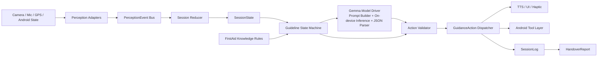
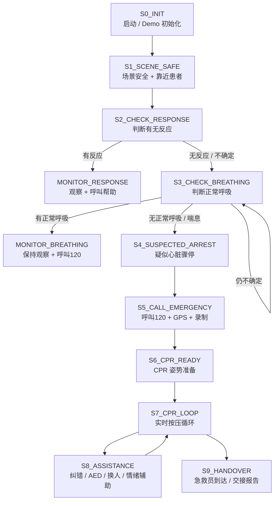
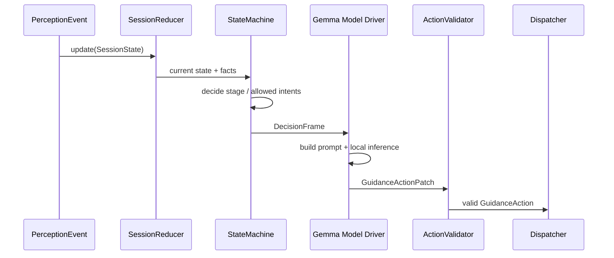

# FirstAid Copilot Agent 技术方案

版本：v0.1  
日期：2026-05-30  
适用阶段：Gemma 4 开发者大赛 MVP / Demo 版本  
MVP 范围：成人疑似心脏骤停 CPR 第一响应场景

## 1. 方案目标

FirstAid Copilot 的目标不是做一个静态急救百科，也不是做一个自由聊天式医疗问答机器人，而是做一个端侧运行的急救陪跑 Agent：

> 在成人疑似心脏骤停场景中，接收用户语音反馈、视觉感知结果和设备状态，依据权威 CPR 流程和本地规则状态机，输出下一步可执行的语音、UI、震动、工具调用和交接报告。

本技术方案用于明确：

- Agent 的架构边界和决策权归属。
- 输入事件 `PerceptionEvent`、会话状态 `SessionState`、输出动作 `GuidanceAction` 的统一协议。
- 成人 CPR 启动规则和状态机转移规则。
- Gemma 4 在系统中的角色、调用时机和安全约束。
- Demo 模式、兜底策略和 Handover Report 生成方案。

## 2. MVP 范围

本次 MVP 只做一个场景：

```text
成人疑似心脏骤停
→ 判断无反应
→ 判断无正常呼吸或濒死喘息
→ 呼叫 120
→ 启动胸外按压
→ 实时纠错
→ 生成交接报告
```

暂不支持：

- 儿童 / 婴儿 CPR。
- 海姆立克、止血、中风 FAST、溺水、触电等其他急救场景。
- 完整真实临床诊断。
- 云端视频分析。
- 面向正式医疗器械注册的生产级闭环。

产品定位：

```text
公民急救辅助工具
不是医疗诊断系统
不是医生替代品
不是最终医疗责任主体
```

## 3. 核心设计原则

### 3.1 用户报告事实，系统判断流程

用户不需要判断“要不要 CPR”，用户只报告观察事实：

- 有没有反应。
- 有没有正常呼吸。
- 是否只有偶尔喘息。
- 是否已经有人拨打 120。

“是否进入 CPR”由规则状态机判断，而不是让用户自发决定，也不是让 Gemma 自由判断。

### 3.2 状态机拥有医疗流程决策权

决策分层如下：

| 层级 | 职责 | 是否拥有医疗流程决策权 |
| --- | --- | --- |
| Guideline State Machine | 根据成人 BLS/CPR 规则推进流程 | 是 |
| Gemma Agent | 理解用户表达、生成话术、解释和复盘 | 否 |
| Perception Model | 输出视觉/动作/情绪结构化事实 | 否 |
| Android Tool Layer | 执行拨号、GPS、录制、震动、TTS、UI | 否 |
| 用户 | 执行现场动作并提供反馈 | 执行动作，不承担流程推理 |

一句话：

> Gemma 可以说得像人，但不能自己行医；关键医疗流程必须由可审核的状态机控制。

### 3.3 高频纠错绕过 LLM

CPR 按压过程中的高频反馈不能等待 LLM 推理：

- 节拍器。
- 按压中断。
- 频率过快/过慢。
- 手位偏移。
- 手臂弯曲。

这些由 `RuleFeedbackEngine` 和感知模型直接生成 `GuidanceAction`。Gemma 只在状态切换、用户提问、安抚解释、报告生成时介入。

### 3.4 离线优先

核心链路应在端侧本地运行：

- 用户语音理解。
- CPR 流程决策。
- 视觉辅助判断。
- 节拍和纠错。
- SessionLog。
- HandoverReport。

联网能力只作为增强能力，例如 AED 地图、救护车到达时间估算、外部分享等。

### 3.5 结构化动作优先

Android 不直接解析 Gemma 的自然语言。Agent 对下游的唯一输出是结构化 `GuidanceAction`：

```text
GuidanceAction = TTS + UI + Haptic + VisualOverlay + ToolAction + LogEvent
```

自然语言只是 `tts.text` 字段，不是系统协议本身。

## 4. 总体架构



### 4.1 模块说明

| 模块 | 输入 | 输出 | 责任边界 |
| --- | --- | --- | --- |
| Perception Adapters | 摄像头、麦克风、STT、设备状态 | `PerceptionEvent` | 只输出事实和置信度 |
| Session Reducer | `SessionState` + `PerceptionEvent` | 新 `SessionState` | 汇总事实、维护状态 |
| Guideline State Machine | `SessionState` + 规则库 | 决策结果 / 动作意图 | 拥有流程决策权 |
| Gemma Model Driver | 当前状态、允许意图、事实、模板、输出 Schema | 候选 `GuidanceActionPatch` / 意图解析 / 报告摘要 | 驱动语言和动作候选，不改变状态机结论 |
| Action Validator | 动作草稿、禁止词、优先级规则 | 合法 `GuidanceAction` | 审查和限流 |
| GuidanceAction Dispatcher | `GuidanceAction` | TTS/UI/震动/工具调用 | 下发动作 |
| Android Tool Layer | `ToolAction` | 工具执行结果 | 拨号、GPS、录制、分享 |
| SessionLog | 动作和状态时间线 | 日志事件 | 支持复盘和交接 |
| HandoverReport Generator | `SessionLog` | 交接报告 | 结构化摘要 |

## 5. 核心数据流

```text
PerceptionEvent
  → Session Reducer 更新 SessionState
  → Guideline State Machine 判断阶段和动作
  → RuleFeedbackEngine 或 Gemma Agent 生成动作内容
  → Action Validator 审查
  → GuidanceAction Dispatcher 执行
  → SessionLog 记录
  → HandoverReport 生成
```

核心链路：

```text
PerceptionEvent + SessionState + FirstAidKnowledge
        ↓
Guideline State Machine + Gemma Agent
        ↓
GuidanceAction + SessionLog + HandoverReport
```

## 6. AgentState v0.1



### 6.1 状态定义

| 状态 | 目标 | 关键输入 | 核心输出 |
| --- | --- | --- | --- |
| `S0_INIT` | 启动会话 | 用户点击一键急救 / Demo 开始 | 检查权限、启动录制 |
| `S1_SCENE_SAFE` | 确认可接近患者 | 用户/视觉反馈 | 提示保证自身安全 |
| `S2_CHECK_RESPONSE` | 判断有无反应 | 用户反馈、麦克风、视觉 | 引导呼叫和拍肩 |
| `S3_CHECK_BREATHING` | 判断是否正常呼吸 | 用户反馈、胸廓起伏视觉 | 引导观察 5 到 10 秒 |
| `S4_SUSPECTED_ARREST` | 固化 CPR 启动结论 | 状态机规则 | 输出疑似心脏骤停处理 |
| `S5_CALL_EMERGENCY` | 呼叫 120、GPS、录制 | 设备状态、用户是否已拨打 | 工具调用 |
| `S6_CPR_READY` | 准备胸外按压 | 用户确认、视觉辅助 | 指导平躺硬地面、定位胸口中央 |
| `S7_CPR_LOOP` | 持续 CPR | CPR 质量事件 | 节拍、纠错、质量分 |
| `S8_ASSISTANCE` | 辅助事件 | 疲劳、AED、多人协作 | 换人、AED、安抚 |
| `S9_HANDOVER` | 交接 | 急救员到达 / 用户触发 | HandoverReport |

## 7. CPRStartRule v0.1

成人疑似心脏骤停 CPR 启动规则：

```text
IF scope.adult_likely == true
AND confirmed_facts.responsive == false
AND (
  confirmed_facts.normal_breathing == false
  OR confirmed_facts.agonal_breathing == true
)
THEN suspected_cardiac_arrest = true
AND start_emergency_call
AND start_cpr_guidance
```

可启动 CPR 的呼吸证据：

| 值 | 含义 | 处理 |
| --- | --- | --- |
| `false` | 明确没有正常呼吸 | 启动 CPR |
| `null` | 用户不确定是否正常呼吸 | 不直接启动 CPR，继续检查并准备呼叫 120 |
| `agonal_breathing == true` | 只有喘息样呼吸 | 不视为正常呼吸，启动 CPR |

推荐话术：

```text
根据你的反馈，他没有反应，也没有正常呼吸。请按疑似心脏骤停处理。现在开始胸外按压。
```

避免说：

```text
他已经心脏骤停了。
这是心梗。
你必须自己决定要不要按。
```

### 7.1 决策结果表

| 决策结果 | 条件 | Agent 输出 |
| --- | --- | --- |
| `START_CPR` | 成人 + 无反应 + 无正常呼吸/喘息 | 启动 120 和 CPR |
| `PREPARE_EMERGENCY_CALL` | 成人 + 无反应，但呼吸尚未判断或仍不确定 | 准备呼叫 120，继续判断呼吸 |
| `MONITOR_AND_CALL_HELP` | 有反应，或有明确正常呼吸 | 不启动 CPR，保持观察并呼叫急救 |
| `OUT_OF_SCOPE` | 明确不是成人场景 | 提示立即呼叫 120，本版只支持成人 CPR 指导 |
| `RECHECK_ON_CONFLICT` | 用户和视觉冲突 | 请求用户复查关键事实 |

### 7.2 伪代码

```ts
function decideCprStart(state: SessionState): Decision {
  const adult = state.scope.adult_likely === true;
  const unresponsive = state.confirmed_facts.responsive === false;
  const normalBreathing = state.confirmed_facts.normal_breathing === true;
  const noNormalBreathing =
    state.confirmed_facts.normal_breathing === false ||
    state.confirmed_facts.agonal_breathing === true;

  if (!adult) return "OUT_OF_SCOPE";
  if (!unresponsive) return "MONITOR_AND_CALL_HELP";
  if (normalBreathing) return "MONITOR_AND_CALL_HELP";

  return noNormalBreathing ? "START_CPR" : "PREPARE_EMERGENCY_CALL";
}
```

## 8. 状态转移规则

| 当前状态 | 触发输入 | 下一状态 | 动作 |
| --- | --- | --- | --- |
| `S0_INIT` | 用户启动 / Demo 开始 | `S1_SCENE_SAFE` | 开启录制、检查权限、提示靠近 |
| `S1_SCENE_SAFE` | 场景可接近 | `S2_CHECK_RESPONSE` | 询问有无反应 |
| `S1_SCENE_SAFE` | 场景危险 | `S1_SCENE_SAFE` | 提示先保证自身安全、呼叫 120 |
| `S2_CHECK_RESPONSE` | 有反应 | `MONITOR_RESPONSE` | 不进入 CPR，继续观察 |
| `S2_CHECK_RESPONSE` | 无反应 | `S3_CHECK_BREATHING` | 准备呼叫 120，判断呼吸 |
| `S2_CHECK_RESPONSE` | 不确定 | `S3_CHECK_BREATHING` | 按高风险推进到呼吸判断 |
| `S3_CHECK_BREATHING` | 有正常呼吸 | `MONITOR_BREATHING` | 不做 CPR，保持观察并呼叫 120 |
| `S3_CHECK_BREATHING` | 无呼吸 / 喘息 | `S4_SUSPECTED_ARREST` | 生成疑似心脏骤停结论 |
| `S3_CHECK_BREATHING` | 仍不确定 | `S3_CHECK_BREATHING` | 继续引导观察并准备呼叫 120 |
| `S4_SUSPECTED_ARREST` | 规则满足 | `S5_CALL_EMERGENCY` | 默认拨打 120，启动 GPS 和录制 |
| `S5_CALL_EMERGENCY` | 拨号已触发 / 已有人拨打 | `S6_CPR_READY` | 引导摆放硬地面、定位胸口中央 |
| `S6_CPR_READY` | 用户准备好 / Demo 事件到达 | `S7_CPR_LOOP` | 启动节拍器和按压指导 |
| `S7_CPR_LOOP` | CPR 质量事件 | `S7_CPR_LOOP` | 规则纠错、质量分更新 |
| `S7_CPR_LOOP` | 疲劳 / AED / 多人事件 | `S8_ASSISTANCE` | 换人、AED、安抚辅助 |
| `S8_ASSISTANCE` | 辅助完成 | `S7_CPR_LOOP` | 回到持续按压 |
| `S7_CPR_LOOP` | 急救员到达 | `S9_HANDOVER` | 生成交接报告 |

## 9. PerceptionEvent v0.1

`PerceptionEvent` 是所有输入的统一事件格式。感知模块只输出事实，不输出医疗决策。

```json
{
  "event_id": "evt_000123",
  "session_id": "sess_001",
  "timestamp": "2026-05-30T10:30:00+08:00",
  "mode": "demo_replay",
  "source": "stt",
  "event_type": "user_response",
  "stage_hint": "S2_CHECK_RESPONSE",
  "sequence_id": 42,
  "ttl_ms": 5000,
  "user_input": {
    "stt_text": "他没有反应",
    "intent": "patient_unresponsive",
    "confidence": 0.92
  },
  "patient_state": {
    "adult_likely": true,
    "lying_down": true,
    "responsive": false,
    "normal_breathing": null,
    "agonal_breathing": null,
    "chest_movement": "unknown",
    "confidence": 0.86,
    "observed_duration_ms": 3000
  },
  "cpr_quality": null,
  "rescuer_state": {
    "emotion": "anxious",
    "fatigue_level": "low",
    "hesitation_seconds": 0,
    "confidence": 0.7
  },
  "device_state": {
    "camera_available": true,
    "mic_available": true,
    "gps_available": true,
    "recording": true,
    "emergency_call_started": false,
    "network": "offline"
  }
}
```

### 9.1 输入来源

| `source` | 含义 |
| --- | --- |
| `stt` | 用户语音转写 |
| `vision_patient` | 患者状态视觉识别 |
| `vision_cpr` | CPR 动作识别 |
| `vision_rescuer` | 施救者状态识别 |
| `device` | Android 设备状态 |
| `demo_script` | Demo 脚本事件 |

### 9.2 事件类型

| `event_type` | 含义 |
| --- | --- |
| `session_started` | 会话开始 |
| `user_response` | 用户回答 |
| `patient_state_update` | 患者状态更新 |
| `breathing_update` | 呼吸判断更新 |
| `cpr_quality_update` | CPR 质量更新 |
| `rescuer_state_update` | 施救者状态更新 |
| `device_state_update` | 设备状态更新 |
| `tool_result` | 工具执行结果 |
| `handover_requested` | 请求生成交接报告 |

### 9.3 事件处理规则

1. `null` 表示未知，不等于 `false`。
2. 低置信度视觉结果不能直接推翻高置信度用户反馈。
3. 用户反馈和视觉冲突时，进入 `RECHECK_ON_CONFLICT`，请求复查。
4. 高频 CPR 事件需要聚合，建议 1 秒更新一次 UI，TTS 5 到 8 秒限流。
5. 过期事件按 `ttl_ms` 丢弃，避免旧感知结果污染当前阶段。

## 10. SessionState v0.1

`SessionState` 是 Agent 的短期记忆和流程真相源。

```json
{
  "session_id": "sess_001",
  "mode": "demo_replay",
  "current_stage": "S3_CHECK_BREATHING",
  "previous_stage": "S2_CHECK_RESPONSE",
  "started_at": "2026-05-30T10:30:00+08:00",
  "updated_at": "2026-05-30T10:30:18+08:00",
  "scope": {
    "scenario": "adult_suspected_cardiac_arrest_cpr",
    "adult_likely": true,
    "scene_safe": true
  },
  "confirmed_facts": {
    "responsive": false,
    "responsive_source": "user",
    "responsive_confidence": 0.92,
    "normal_breathing": null,
    "agonal_breathing": null,
    "breathing_source": null,
    "breathing_confidence": null,
    "suspected_cardiac_arrest": false
  },
  "tool_state": {
    "emergency_call_status": "not_started",
    "gps_attached": false,
    "recording_status": "recording",
    "handover_generated": false
  },
  "cpr_state": {
    "started": false,
    "started_at": null,
    "total_compressions": 0,
    "current_rate": null,
    "average_rate": null,
    "quality_score": null,
    "last_interruption_seconds": 0,
    "last_correction": null
  },
  "dialogue_state": {
    "pending_question": "check_breathing",
    "last_tts_intent": "ask_breathing_check",
    "last_tts_at": "2026-05-30T10:30:15+08:00",
    "repeat_count": 0,
    "spoken_intents": [
      "ask_response_check",
      "ask_breathing_check"
    ]
  },
  "action_control": {
    "active_priority": "normal",
    "cooldowns": {
      "correction.rate_low": "2026-05-30T10:30:10+08:00",
      "encouragement": "2026-05-30T10:30:05+08:00"
    }
  },
  "handover_timeline": [
    {
      "time": "10:30:03",
      "type": "session_started",
      "detail": "user_started_first_aid"
    },
    {
      "time": "10:30:12",
      "type": "patient_unresponsive",
      "detail": "reported_by_user"
    }
  ],
  "demo_state": {
    "script_id": "cpr_main_demo_v1",
    "elapsed_ms": 18000,
    "current_step": "breathing_check"
  }
}
```

### 10.1 SessionState 更新方式

建议使用 reducer：

```text
old SessionState
+ new PerceptionEvent
→ updated SessionState
→ StateMachine decides next GuidanceAction
```

不要让多个模块直接修改状态，避免比赛现场出现状态竞争和不可复现问题。

## 11. GuidanceAction v0.1

`GuidanceAction` 是 Agent 对下游的唯一动作协议。

```json
{
  "action_id": "act_000123",
  "session_id": "sess_001",
  "timestamp": "2026-05-30T10:30:00+08:00",
  "stage": "S5_CALL_EMERGENCY",
  "intent": "start_emergency_call_and_cpr",
  "priority": "critical",
  "source": "state_machine",
  "reason_codes": [
    "adult_scope",
    "unresponsive",
    "no_normal_breathing"
  ],
  "ttl_ms": 5000,
  "throttle_key": "stage.start_cpr",
  "min_interval_ms": 0,
  "tts": {
    "text": "根据你的反馈，他没有反应，也没有正常呼吸。请按疑似心脏骤停处理。我将为你拨打120，现在准备开始胸外按压。",
    "tone": "calm_firm",
    "speed": "normal",
    "interrupt_policy": "interrupt_lower_priority"
  },
  "ui": {
    "main_text": "疑似心脏骤停",
    "secondary_text": "正在呼叫120，准备胸外按压",
    "status_tags": ["无反应", "无正常呼吸", "CPR准备"],
    "quality_score": null,
    "primary_button": {
      "label": "已拨打120",
      "action": "mark_emergency_called"
    }
  },
  "haptic": {
    "enabled": false
  },
  "visual_overlay": {
    "mode": "prepare_cpr_position",
    "highlight_target": "chest_center"
  },
  "tool_actions": [
    {
      "type": "emergency_call",
      "target": "120",
      "mode": "auto_with_cancel_window",
      "cancel_window_seconds": 3,
      "requires_user_confirmation": false
    },
    {
      "type": "start_local_recording",
      "requires_user_confirmation": false
    },
    {
      "type": "attach_gps_location",
      "requires_user_confirmation": false
    }
  ],
  "log_event": {
    "type": "suspected_cardiac_arrest",
    "detail": "unresponsive_and_no_normal_breathing"
  }
}
```

### 11.1 priority

| priority | 场景 |
| --- | --- |
| `critical` | 呼叫 120、开始 CPR、不要停止按压 |
| `high` | 手位严重错误、频率严重异常、中断 |
| `normal` | 姿势提醒、换人提醒、AED 辅助 |
| `low` | 鼓励、解释、复盘 |

### 11.2 source

| source | 含义 |
| --- | --- |
| `state_machine` | 流程状态机 |
| `rule_feedback` | 实时纠错规则 |
| `gemma_agent` | Gemma 生成/补充 |
| `demo_script` | Demo 回放事件 |

### 11.3 interrupt_policy

| 策略 | 含义 |
| --- | --- |
| `interrupt_lower_priority` | 可打断低优先级播报 |
| `do_not_interrupt` | 不打断当前播报 |
| `do_not_interrupt_critical` | 不打断 critical 播报 |
| `replace_same_intent` | 替换同类旧提示 |

## 12. 实时 CPR 纠错设计

### 12.1 双循环架构

```text
慢循环：状态机 + Gemma
用于阶段切换、用户问题、安抚、报告生成。

快循环：感知模型 + 规则纠错
用于节拍、中断、频率、手位、手臂姿势。
```

### 12.2 纠错优先级

| 优先级 | 纠错类型 | 推荐 TTS |
| --- | --- | --- |
| 1 | 按压中断 | “不要停，继续按压。” |
| 2 | 未开始按压 | “双手掌根放到胸口中央，现在开始按。” |
| 3 | 手位明显错误 | “位置向右一点。” / “手再往下移一点。” |
| 4 | 频率错误 | “再快一点。” / “稍微慢一点。” |
| 5 | 手臂姿势 | “手臂伸直，用上半身向下压。” |
| 6 | 情绪鼓励 | “你做得很好，继续跟着节奏。” |

规则：

- 每次 TTS 只播一个最重要纠错。
- UI 可以同时展示质量分和细项。
- TTS 对同类纠错设置 5 到 8 秒冷却。
- critical 提示不能被 normal/low 打断。

### 12.3 实时纠错示例

```json
{
  "stage": "S7_CPR_LOOP",
  "intent": "correct_compression_rate",
  "priority": "high",
  "source": "rule_feedback",
  "reason_codes": ["compression_rate_low", "rate_92_per_min"],
  "ttl_ms": 3000,
  "throttle_key": "correction.rate_low",
  "min_interval_ms": 8000,
  "tts": {
    "text": "再快一点，跟着震动按。",
    "tone": "calm_firm",
    "interrupt_policy": "do_not_interrupt_critical"
  },
  "ui": {
    "main_text": "按压偏慢",
    "secondary_text": "目标 100-120 次/分钟",
    "quality_score": 68
  },
  "haptic": {
    "enabled": true,
    "pattern": "metronome",
    "bpm": 110
  },
  "visual_overlay": {
    "mode": "rate_feedback"
  },
  "log_event": {
    "type": "correction",
    "detail": "compression_rate_low"
  }
}
```

## 13. Gemma Agent Layer

Gemma 在系统中的定位：

```text
受规则约束的急救话术和理解层
不是医疗流程决策层
```

更准确地说，本项目应把 Gemma 接成 **Gemma Model Driver**：

```text
状态机决定当前允许做什么
Gemma 根据状态、事实、模板和输出 Schema 生成候选动作
Action Validator 审查后变成正式 GuidanceAction
```

也就是：

```text
Medical flow is rule-driven
Interaction is Gemma-driven
Execution is Android-driven
```

### 13.1 Gemma Model Driver 运行链路

Gemma 不直接接管整个系统，而是作为 Agent 的模型驱动器嵌入在状态机之后、动作校验器之前。



其中 `DecisionFrame` 是喂给 Gemma 的受控上下文包：

```json
{
  "stage": "S6_CPR_READY",
  "allowed_intents": [
    "guide_cpr_position",
    "answer_position_question",
    "encourage_rescuer"
  ],
  "facts": {
    "adult_likely": true,
    "responsive": false,
    "normal_breathing": false,
    "emergency_call_status": "started"
  },
  "safety_phrases": [
    "请按疑似心脏骤停处理。",
    "双手掌根放在胸口中央。",
    "现在开始胸外按压。"
  ],
  "output_schema": "GuidanceActionPatch",
  "user_input": "我应该按哪里？",
  "language": "zh-CN"
}
```

Gemma 输出的不是最终动作，而是候选补丁：

```json
{
  "intent": "guide_cpr_position",
  "tts": {
    "text": "双手掌根放在胸口中央，现在开始按压。",
    "tone": "calm_firm"
  },
  "ui": {
    "main_text": "胸口中央",
    "secondary_text": "双手掌根按压"
  },
  "reason": "user_asked_position"
}
```

然后由 `ActionValidator` 补齐优先级、工具动作、限流字段，并检查它是否符合当前状态允许动作。

### 13.2 Gemma Driver 调用时机

Gemma 的调用要少而关键，避免把高频急救动作变成大模型延迟问题。

| 调用时机 | 是否调用 Gemma | 说明 |
| --- | --- | --- |
| 用户语音回答含糊 | 是 | 把 STT 文本解析成意图，例如“好像没气了” |
| 状态切换 | 是 | 生成自然、克制的阶段话术 |
| 用户提问 | 是 | 在当前 allowed intents 内回答 |
| CPR 高频纠错 | 默认否 | 由规则直接生成，Gemma 可低频补充 |
| 情绪安抚 | 是 | 根据施救者状态调整语气 |
| HandoverReport | 是 | 总结 SessionLog 成自然报告 |
| Demo 复盘 | 是 | 生成讲解性总结 |

### 13.3 Gemma Driver 组件

建议实现成四个小组件：

```text
GemmaRuntime
  负责模型加载、预热、本地推理、超时控制。

GemmaPromptBuilder
  把 SessionState、DecisionFrame、SafetyPhrases、AllowedIntents 组装成 Prompt。

GemmaResponseParser
  把模型输出解析成 GuidanceActionPatch，不允许直接执行自然语言。

GemmaFallbackPolicy
  模型超时、输出非法或加载失败时，回退到固定模板。
```

Android 侧可以这样理解：

```text
StateMachine 是方向盘
GemmaRuntime 是语言发动机
ActionValidator 是刹车
Dispatcher 是执行机构
```

### 13.4 Gemma 输入 Prompt 结构

建议 Prompt 不写成长篇聊天历史，而写成稳定的结构化上下文：

```text
[System Rules]
你是 FirstAid Copilot 的急救引导话术层...

[Current Stage]
S6_CPR_READY

[Confirmed Facts]
- adult_likely: true
- responsive: false
- normal_breathing: false
- emergency_call_status: started

[Allowed Intents]
- guide_cpr_position
- answer_position_question
- encourage_rescuer

[Safety Phrases]
- 双手掌根放在胸口中央。
- 现在开始胸外按压。

[User Input]
我应该按哪里？

[Output JSON Schema]
只输出 GuidanceActionPatch JSON。
```

### 13.5 Gemma 输出约束

Gemma 必须输出 JSON，不输出自由段落：

```json
{
  "intent": "string",
  "tts": {
    "text": "string",
    "tone": "calm_firm | calm_soft | urgent"
  },
  "ui": {
    "main_text": "string",
    "secondary_text": "string"
  },
  "reason": "string"
}
```

禁止 Gemma 输出：

- 新的状态跳转。
- 未授权工具调用。
- 未审核医学步骤。
- 确定诊断。
- 多段解释性文本。

### 13.6 Gemma 失败兜底

Gemma 可能出现加载慢、输出非法、推理超时、JSON 解析失败等问题。急救场景不能因此停住。

兜底策略：

| 失败类型 | 处理 |
| --- | --- |
| 模型未加载 | 使用状态机固定模板 |
| 推理超时 | 丢弃本次 Gemma 输出，继续规则动作 |
| JSON 非法 | 使用 `GemmaResponseParser` 拒绝，回退模板 |
| 话术越界 | `ActionValidator` 拦截 |
| 连续失败 | 降级为 pure state-machine mode |

降级后系统仍能完成：

```text
判断无反应
判断呼吸
呼叫 120
启动 CPR
节拍器
基础纠错
基础 HandoverReport
```

这保证 Gemma 是增强驱动，而不是单点故障。

### 13.7 Gemma 适合做的事

- 将 STT 文本映射为用户意图，例如“他好像没气了”。
- 根据当前状态生成简短、稳定、低恐慌的话术。
- 回答用户在当前状态下的简单问题，例如“我按哪里？”。
- 根据施救者状态调整语气。
- 将 SessionLog 总结成 HandoverReport 草稿。
- Demo 结束后生成复盘总结。

### 13.8 Gemma 不允许做的事

- 自由诊断疾病。
- 改变 CPRStartRule。
- 新增未经审核的医疗步骤。
- 跳过状态机直接输出工具调用。
- 说“他已经心脏骤停了”“这是心梗”等确定诊断。
- 承诺结果，例如“这样一定能救活”。

### 13.9 System Prompt 草案

```text
你是 FirstAid Copilot 的急救引导话术层。
你不能诊断疾病，不能改变状态机决策，不能新增未经审核的医疗步骤。
你只能基于当前 state、allowed_intents、facts 和 safety_phrases 生成一句简短指令。
每次最多给一个动作。
优先让用户继续胸外按压。
如果用户表达不清，只能请求确认当前状态机允许确认的事实。
输出必须短、明确、冷静，不恐吓、不承诺结果。
```

### 13.10 Action Validator

Gemma 生成的内容必须通过校验：

| 校验项 | 规则 |
| --- | --- |
| 禁止词 | 不得包含确定诊断、结果承诺、恐吓表述 |
| 长度 | TTS 建议不超过 30 个汉字，关键状态可放宽 |
| 动作数量 | 每次只给一个主要动作 |
| intent 合法性 | 必须属于当前状态允许动作 |
| 医疗流程 | 不得修改状态机结论 |
| 优先级 | 不得打断 critical 动作 |

## 14. SafetyPhrases v0.1

### 14.1 允许话术

| 场景 | 推荐话术 |
| --- | --- |
| 判断反应 | “请大声呼叫他，并轻拍双肩。” |
| 无反应 | “他没有反应。现在检查呼吸。” |
| 判断呼吸 | “请看胸口 5 到 10 秒，有没有规律、正常的起伏？” |
| 呼吸不确定 | “请继续看胸口 5 到 10 秒，确认有没有正常起伏。” |
| 启动 CPR | “请按疑似心脏骤停处理。现在开始胸外按压。” |
| 呼叫 120 | “我将为你拨打 120，请保持手机免提。” |
| 按压位置 | “双手掌根放在胸口中央。” |
| 节奏 | “跟着震动按，快速有力。” |
| 中断 | “不要停，继续按压。” |
| 鼓励 | “你做得很好，继续跟着节奏。” |
| 交接 | “急救员到达后，我会生成交接报告。” |

### 14.2 禁止话术

| 类型 | 禁止说法 |
| --- | --- |
| 诊断过度 | “他已经心脏骤停了。” |
| 疾病判断 | “这是心梗。” “这是脑卒中。” |
| 结果承诺 | “这样一定能救活。” |
| 责任恐吓 | “如果你不按他会死。” |
| 复杂解释 | “现在我来解释心肺复苏的原理。” |
| 过度安慰 | “不用担心，没事的。” |
| 让用户自决 | “你自己决定要不要按压。” |

## 15. ToolAction 策略

| 工具 | 策略 | 说明 |
| --- | --- | --- |
| 120 呼叫 | 默认触发，3 秒取消窗口 | Demo 中可模拟拨号 |
| GPS | 随 120 和交接自动附加 | 需要系统权限 |
| 本地录制 | 首次安装授权后默认开启 | 不上传云端 |
| 震动节拍 | CPR 开始后自动启动 | 目标 100 到 120/min |
| AED 地图 | MVP 中作为辅助 | 离线缓存优先 |
| 分享报告 | 必须用户主动同意 | 不能默认外发 |
| 分享视频 | 必须用户主动同意 | 视频本地加密保存 |
| 删除视频 | 必须用户主动确认 | 支持隐私控制 |

推荐拨号动作：

```json
{
  "type": "emergency_call",
  "target": "120",
  "mode": "auto_with_cancel_window",
  "cancel_window_seconds": 3,
  "requires_user_confirmation": false
}
```

## 16. HandoverReport v0.1

HandoverReport 面向急救员或医院，用于快速了解现场处置过程。

### 16.1 字段

| 字段 | 示例 |
| --- | --- |
| 患者 ID | 匿名 |
| 初判时间 | 14:32:07 |
| 症状判断 | 无反应、无正常呼吸、疑似心脏骤停 |
| CPR 开始时间 | 14:32:29 |
| 累计按压次数 | 487 次 |
| 平均按压频率 | 112/min |
| 平均质量评分 | 87/100 |
| 中断事件 | 14:33:15 中断 3 秒 |
| 纠错事件 | 手位偏左、频率偏慢、手臂弯曲 |
| AED 状态 | 未找到 / 已使用 |
| 施救者状态 | 疲劳，已提醒换人 |
| 视频记录 | 已本地保存，等待用户同意分享 |

### 16.2 Demo 报告示例

```text
患者ID：匿名
初判时间：演示开始后 00:20
症状：无反应，无正常呼吸，疑似心脏骤停
CPR 开始：00:45
累计按压：约 260 次
平均频率：112/min
平均质量评分：78/100
中断事件：01:45 中断 3 秒，已提醒继续
纠错事件：手位偏左、频率偏慢、手臂弯曲
AED：02:35 现场人员取到 AED，已提示继续 CPR
视频记录：已本地保存，等待用户同意分享
```

## 17. Demo 模式设计

比赛版本优先保证完整演示链路。

### 17.1 三种输入模式

| 模式 | 用途 |
| --- | --- |
| `real_perception` | 真实摄像头和麦克风输入，能跑就跑 |
| `demo_assisted` | 真实 UI + 真实语音交互，关键感知可脚本注入 |
| `demo_replay` | 完全按时间轴播放 mock 事件，保证现场稳定 |

比赛现场建议默认使用 `demo_assisted`，出现识别风险时一键切换 `demo_replay`。

### 17.2 Demo 主线

```text
启动急救
→ 判断无反应
→ 确认无正常呼吸/濒死喘息
→ 触发 120 + GPS + 本地录制
→ 开始 CPR
→ 质量分从低到高
→ 插入纠错、鼓励、换人/AED 辅助
→ 急救员到达
→ Handover Report
```

### 17.3 DemoEventScript v0.1

| 时间 | 事件 | Agent 表现 |
| --- | --- | --- |
| `00:00` | 用户点击“一键急救” | 开始录制，进入安全确认 |
| `00:05` | `scene_safe=true` | 引导靠近患者 |
| `00:10` | 用户反馈“他没有反应” | 进入呼吸判断 |
| `00:20` | 用户反馈“好像没有呼吸，偶尔喘一下” | 判定疑似心脏骤停 |
| `00:25` | 触发 120 + GPS | “我将为你拨打 120” |
| `00:35` | 进入 CPR 准备 | 指导平躺硬地面、胸口中央 |
| `00:45` | CPR 开始，质量分 32 | 启动震动节拍器 |
| `00:55` | 手位偏左，频率 92/min | “位置向右一点，再快一点” |
| `01:10` | 手臂弯曲，质量分 55 | “手臂伸直，用上半身向下压” |
| `01:25` | 节奏改善，质量分 78 | “很好，继续跟着节奏” |
| `01:45` | 中断 3 秒 | “不要停，继续按压” |
| `02:00` | 质量分 91 | UI 展示高分稳定按压 |
| `02:15` | 施救者疲劳 | 提醒旁人准备换手 |
| `02:35` | AED 事件 | 切入“有人取到 AED”辅助提示 |
| `03:00` | 回到 CPR 持续循环 | 强调继续按压直到急救员接手 |
| `03:30` | 急救员到达 | 生成 Handover Report |
| `04:00` | 展示报告 + 本地视频记录 | 完成临床价值闭环 |

### 17.4 质量分曲线

```text
00:45  32
00:55  45
01:10  55
01:25  78
02:00  91
03:00  88
```

这个曲线是 Demo 的视觉锚点：评委能直观看到 AI 纠错让按压质量提升。

### 17.5 现场兜底

| 风险 | 兜底 |
| --- | --- |
| STT 识别错 | 隐藏按钮注入用户回答 |
| 视觉识别错 | 切到 demo_assisted 的质量分脚本 |
| 拨号风险 | Demo 中弹出“模拟拨打 120” |
| 网络不可用 | 强调核心链路离线运行 |
| 声音太吵 | UI 大字同步显示每条 TTS |
| 评委不配合 | 队员扮演施救者 |

## 18. 工程实现建议

### 18.1 Agent 核心包

建议模块：

```text
agent/
  state/
    SessionState.kt
    AgentStage.kt
  events/
    PerceptionEvent.kt
  actions/
    GuidanceAction.kt
    ToolAction.kt
  rules/
    CprStartRule.kt
    TransitionRules.kt
    FeedbackRules.kt
  gemma/
    GemmaRuntime.kt
    GemmaPromptBuilder.kt
    GemmaResponseParser.kt
    GemmaFallbackPolicy.kt
    DecisionFrame.kt
    GuidanceActionPatch.kt
  safety/
    SafetyPhraseValidator.kt
    ActionValidator.kt
  demo/
    DemoEventScript.kt
    DemoEventPlayer.kt
  report/
    SessionLog.kt
    HandoverReportGenerator.kt
```

如果 Android 端来不及完整实现，可以先用 JSON 文件和简单 Kotlin/Java 数据类实现，不强行抽象过度。

### 18.2 本地规则库

建议规则文件：

```text
knowledge/
  adult_cpr_rules.json
  safety_phrases.json
  allowed_actions.json
  demo_script_cpr_main_v1.json
  handover_template.json
```

规则库应该版本化：

```json
{
  "knowledge_version": "adult_cpr_mvp_2026_05_30",
  "medical_review_status": "pending_review",
  "scenario": "adult_suspected_cardiac_arrest_cpr"
}
```

### 18.3 最小可运行链路

优先打通：

```text
DemoEventScript
→ PerceptionEvent
→ SessionReducer
→ StateMachine
→ Gemma Model Driver
→ GuidanceAction
→ UI/TTS mock
→ SessionLog
→ HandoverReport
```

感知真实接入可以后置，先保证 Agent 主链路可演示、可复盘、可测试。

## 19. 测试方案

### 19.1 状态机单元测试

必须覆盖：

- 有反应时不进入 CPR。
- 无反应 + 有正常呼吸时不进入 CPR。
- 无反应 + 无正常呼吸时进入 CPR。
- 无反应 + 不确定呼吸时不直接进入 CPR，继续呼吸检查并准备呼叫 120。
- 喘息样呼吸不视为正常呼吸。
- 用户与视觉冲突时进入复查。

### 19.2 GuidanceAction 校验测试

必须覆盖：

- critical 能打断 low。
- low 不能打断 critical。
- 同类纠错 8 秒内不重复播。
- 禁止诊断话术被拦截。
- 分享视频必须要求用户确认。
- 拨打 120 使用取消窗口。

### 19.3 Demo 回放测试

必须覆盖：

- 5 分钟 Demo 能完整跑完。
- 任意时刻切换 `demo_replay` 不崩。
- HandoverReport 字段完整。
- 质量分曲线按预期展示。
- 断网状态不影响主链路。

## 20. 风险与对策

| 风险 | 影响 | 对策 |
| --- | --- | --- |
| Gemma 端侧延迟高 | 影响语音响应 | 高频纠错绕过 Gemma，状态切换才调用 |
| 视觉识别不稳定 | 影响 Demo | demo_assisted 和 demo_replay 兜底 |
| STT 噪声大 | 用户回答识别错 | UI 按钮/隐藏注入兜底 |
| 医疗话术越界 | 合规风险 | SafetyPhrases + Validator |
| 120 真实拨号误触 | 演示风险 | Demo 中使用模拟拨号 |
| 视频隐私敏感 | 信任风险 | 本地加密、默认不上传、分享需确认 |
| 状态重复跳转 | 体验混乱 | SessionReducer + idempotency key |
| TTS 过于频繁 | 用户压力大 | priority + cooldown + interrupt_policy |

## 21. 三周开发路线

### Week 1：Agent 主链路

- 定义 Kotlin/JSON 数据结构：`PerceptionEvent`、`SessionState`、`GuidanceAction`。
- 实现状态机和 `CPRStartRule`。
- 实现 DemoEventScript 回放。
- 实现 TTS/UI mock。
- 实现 SessionLog 和基础 HandoverReport。

验收标准：

```text
用 mock 事件能完整跑通：
无反应 → 无正常呼吸 → 呼叫120 → CPR → 纠错 → 报告
```

### Week 2：感知和 Android 集成

- 接入 STT 文本。
- 接入视觉 CPR 质量字段。
- 接入震动节拍器。
- 接入录制、GPS、模拟 120。
- 接入质量分 UI 和视觉提示。
- 加入 ActionValidator 和限流。

验收标准：

```text
Demo assisted 模式稳定运行，真实感知失败时可脚本兜底。
```

### Week 3：打磨 Demo 和交付

- 优化 SafetyPhrases。
- 完整排练 5 分钟 Demo。
- 录制 Demo 视频。
- 生成技术报告架构图。
- 准备识别失败、手机没电、声音太吵等备选方案。
- 医学负责人审查 CPR 话术。

验收标准：

```text
现场不依赖网络，至少 5 次连续跑通完整 Demo。
```

## 22. 团队分工建议

| 角色 | 负责内容 |
| --- | --- |
| 产品 / 医学合规 | CPR 流程、话术审核、Demo 叙事 |
| Edge Gemma / Agent | 状态机、规则库、Gemma Prompt、协议 |
| CPR 感知识别 | 患者状态、手位、频率、中断、质量分 |
| Android 终端 | TTS、UI、震动、GPS、录制、工具调用 |
| QA / Demo 工程 | DemoEventScript、回放、兜底、测试看板 |

协作原则：

```text
Android 负责跑起来
Gemma 负责说清楚
状态机负责判定流程
感知负责看明白
工具链负责测稳定
产品医学负责讲可信
```

## 23. 最终定案

本方案的核心取舍是：

> FirstAid Copilot 的可靠性来自“可审核规则状态机 + 端侧 Gemma 话术能力 + 结构化工具调用”，而不是让大模型自由决定急救流程。

比赛版本优先证明三件事：

1. 普通人不需要提前学习，也能被一步步带入 CPR。
2. 端侧 Agent 能在离线、低延迟、隐私敏感场景中工作。
3. 视觉纠错和 Handover Report 让产品从“急救教程”升级为“急救陪跑系统”。

## 24. 参考资料

项目资料：

- `Agent_Input_Output.md`
- `FirstAid Copilot(1).pdf`
- `team_division_table.html`

外部参考：

- [AHA 2025 Adult Basic Life Support](https://cpr.heart.org/en/resuscitation-science/cpr-and-ecc-guidelines/adult-basic-life-support)
- [AHA Hands-Only CPR](https://cpr.heart.org/en/cpr-courses-and-kits/hands-only-cpr)
- [Google Developers Blog: Bring state-of-the-art agentic skills to the edge with Gemma 4](https://developers.googleblog.com/bring-state-of-the-art-agentic-skills-to-the-edge-with-gemma-4/)
