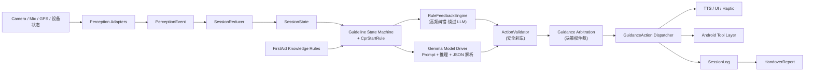
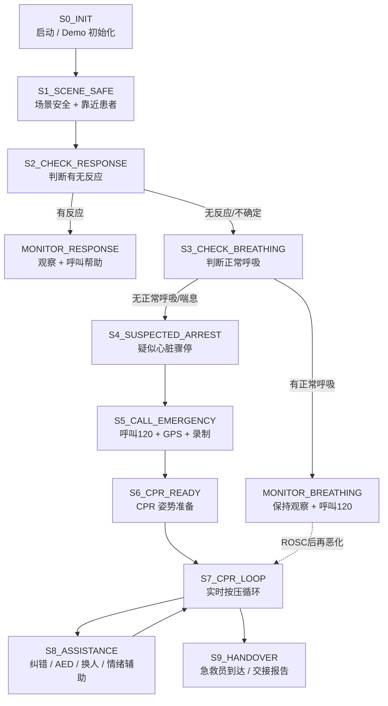
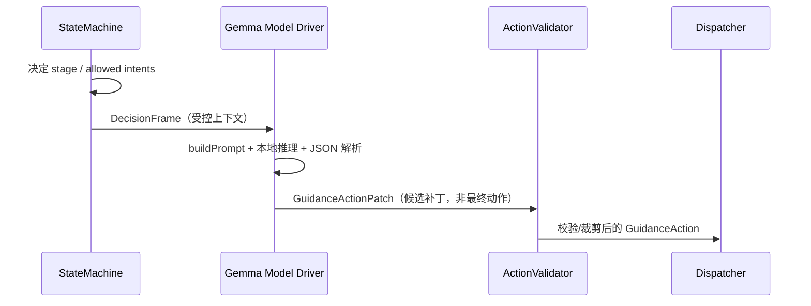

# FirstAid Copilot · 端侧离线 AI 急救陪跑 Agent

> 黄金 4 分钟，AI 陪你一起救。
>
> 一个**完全端侧、离线运行**的 AI 急救陪跑 Agent。在成人疑似心脏骤停现场，它用语音 + 视觉 + 节拍音，一步步带普通人完成心肺复苏（CPR），并在急救员到达时生成结构化交接报告（Handover Report）。


> [!IMPORTANT]
> **能力边界**：FirstAid Copilot 是公民急救**辅助**工具，**不是**医疗诊断系统，**不是**医生替代品，**不**承担最终医疗责任。当前 MVP 范围仅覆盖**成人疑似心脏骤停 CPR**。紧急情况请第一时间拨打 120。Demo 版本**绝不自动拨打真实 120**（使用「模拟拨打」演示）。

---

## 一句话理解这个项目

```text
Medical flow is rule-driven    —— 医疗流程由「可审核的规则状态机」决策
Interaction  is Gemma-driven   —— 自然语言理解与话术由端侧 Gemma 负责
Execution    is Android-driven —— UI / 语音 / 节拍 / 工具调用由 Android 执行
```

关键医疗判断**永远**掌握在确定性的规则状态机手里；Gemma 只负责「把话说清楚、听懂用户」，且所有输出都要经过安全校验器（`ActionValidator`）这道刹车。这套架构让产品同时做到 **可信 + 好用 + 安全**。

---

## 目录

- [它是什么 / 不是什么](#它是什么--不是什么)
- [核心特性](#核心特性)
- [系统架构](#系统架构)
- [仓库结构](#仓库结构)
- [核心协议：三件套](#核心协议三件套)
- [急救状态机与 CPR 启动规则](#急救状态机与-cpr-启动规则)
- [安全体系](#安全体系actionvalidator--仲裁)
- [Gemma 端侧集成](#gemma-端侧集成)
- [语音系统](#语音系统)
- [视觉 CPR 识别](#视觉-cpr-识别)
- [Android 应用](#android-应用)
- [快速开始](#快速开始)
- [环境变量配置](#环境变量配置)
- [测试与质量保障](#测试与质量保障)
- [脚本工具链](#脚本工具链)
- [Demo 模式](#demo-模式)
- [安全、隐私与合规](#安全隐私与合规)
- [技术栈](#技术栈)
- [文档索引](#文档索引)
- [许可](#许可)

---

## 它是什么 / 不是什么

| 它**是** | 它**不是** |
| --- | --- |
| 端侧离线运行的急救**陪跑** Agent | 不是急救百科 / 静态教程 |
| 成人疑似心脏骤停 CPR 的第一响应助手 | 不是自由聊天的医疗问答机器人 |
| 用「规则把关 + AI 说话 + 结构化工具」的可审核系统 | 不是让大模型自由决定急救流程的系统 |
| 实时纠错 + 交接报告的「急救陪跑系统」 | 不是医疗诊断系统 / 医生替代品 |

**当前范围（MVP）**：成人疑似心脏骤停 CPR。暂不支持儿童/婴儿 CPR、海姆立克、止血、中风 FAST、溺水、触电等其他场景。

---

## 核心特性

### 1. 端侧离线，关键时刻不掉链子

语音理解、流程决策、视觉纠错、节拍、会话记录、交接报告——**核心链路全部在手机本地运行**，不依赖网络。底层是端侧 Gemma 4 E2B（LiteRT-LM 运行时）+ 离线流式语音（sherpa-onnx STT/TTS）+ MediaPipe 视觉。越是「救护车来不及、信号还不好」的地方越能用。

### 2. 规则掌舵，AI 说话：可信 + 好用 + 安全

医疗流程决策权属于**可审核的规则状态机**（`S0 → S9`），不交给大模型自由发挥。Gemma 只负责「听懂用户 + 把话说人话」，且所有输出经过 `ActionValidator` 硬校验与 `guidanceArbitration` 决策权仲裁。

### 3. 实时 CPR 纠错，像有教练在旁边

**双循环架构**：高频纠错（节拍、按压中断、频率过快/过慢、手位偏移、手臂弯曲）**绕过大模型、由规则即时反馈**，质量分实时跳动。节拍器锁定 100–120 次/分钟，且在静音/振动模式下也能响（`AudioTrack` 走 `USAGE_MEDIA`）。

### 4. 低延迟语音陪跑，开口就回应

流式低延迟语音 +「**确定性先行、Gemma 异步增强**」（`ack_then_async`）：关键指令立刻播报，AI 答复随后补充。真机实测关键语音路径 **p95 < 1000ms**；开放问答答复 **p95 < 3000ms**。

### 5. 一键交接，从「急救教程」升级为「急救陪跑系统」

全程自动记录 `SessionLog`，急救员到达时一键生成结构化 **Handover Report**（初判时间、症状、CPR 起始、累计按压、平均频率、质量评分、中断/纠错事件、AED 状态等），让现场处置可交接、可复盘。

### 加分项：隐私与安全可信

本地录制、默认不上传云端；分享/删除需用户明确确认；Demo 版**绝不自动拨打真实 120**。

---

## 系统架构

### 三层职责边界

```text
┌─────────────────────────────────────────────────────────────────┐
│  Perception 感知层  ── 只输出事实与置信度，不做医疗决策             │
│  麦克风/STT · 后置摄像头/视觉 · 设备状态 · Demo 脚本               │
└───────────────┬─────────────────────────────────────────────────┘
                │ PerceptionEvent
┌───────────────▼─────────────────────────────────────────────────┐
│  Agent Core 决策层（拥有医疗流程决策权）                          │
│  SessionReducer → StateMachine + CprStartRule → RuleFeedbackEngine│
│           → (可选) Gemma Driver → ActionValidator → Arbitration   │
└───────────────┬─────────────────────────────────────────────────┘
                │ GuidanceAction（唯一动作协议，已校验）
┌───────────────▼─────────────────────────────────────────────────┐
│  Execution 执行层（Android）                                      │
│  UI 大字 · TTS 语音 · 节拍音 · 工具调用(120/GPS/录制) · 日志       │
└─────────────────────────────────────────────────────────────────┘
```

### 端到端数据流



### 双循环：慢循环负责思考，快循环负责救命

| | 慢循环（Slow loop） | 快循环（Fast loop） |
| --- | --- | --- |
| **负责** | 阶段切换、用户提问、安抚、报告生成 | 节拍、按压中断、频率、手位、手臂姿势 |
| **驱动** | 状态机 + Gemma | 感知模型 + `RuleFeedbackEngine` 规则 |
| **是否等 LLM** | 可短超时调用 Gemma，超时即回退模板 | **绝不等 LLM**，即时反馈 |
| **典型延迟** | 关键路径 p95 < 1000ms / 开放问答 < 3000ms | 节拍自维持，与单轮服务消息解耦 |

> 设计取舍：CPR 按压过程中的高频反馈不能等待 LLM 推理，因此由规则与感知直接生成 `GuidanceAction`；Gemma 只在状态切换、提问、安抚、报告时介入。这保证了 Gemma 是「增强驱动」而非「单点故障」。

---

## 仓库结构

本仓库是一个 monorepo，包含 **Node.js Agent Core**（参考实现 / 语音后端 / 测试基线）与 **Android 应用**（端侧客户端）两大部分，二者共享同一套 `GuidanceAction` 协议与知识库/Prompt 契约。

```text
first-aid/
├── src/                      # Node.js Agent Core（v0.1 参考实现 + 语音后端）
│   ├── domain/               # 协议三件套与工厂：types / stages / actionFactories
│   ├── engine/               # 规则引擎：状态机 / CPR 启动规则 / 归约 / 高频纠错 / 校验 / 仲裁
│   ├── gemma/                # Gemma 驱动：runtime / prompt / 解析 / NLU / 兜底 / serve daemon
│   ├── voice/                # 语音系统：HTTP+WS 服务 / STT / TTS / 流式 / 缓存 / 指标 / 意图
│   ├── vision/               # 视觉 CPR 质量指标（与 Android 共享口径）
│   ├── dispatch/             # GuidanceAction 分发器与各执行通道 sink
│   ├── report/               # SessionLog / 交接报告 / 叙述化 / 120 播报摘要
│   ├── demo/                 # Demo 事件回放器
│   ├── sim/                  # 闭环场景模拟器（自博弈验证）
│   ├── knowledge/            # 知识库加载层
│   ├── agent/runPipeline.js  # Agent 主链路编排
│   ├── cli/                  # 命令行：demo / dispatcher / scenario / verify
│   └── config/loadEnv.js     # 零依赖 .env 加载器
│
├── android/                  # Android 应用（Kotlin + Jetpack Compose + MVVM）
│   └── app/src/main/java/com/firstaid/copilot/
│       ├── execution/        # GuidanceAction 数据模型 + 分发器 + Android sink 适配器
│       └── live/             # 实时会话
│           ├── LiveSessionViewModel.kt   # 核心 orchestrator（单写 LiveUiState）
│           ├── *Transport / *Channel     # thin client(HTTP/WS) 与本地 agent 两条路径
│           ├── audio/        # MetronomeController（节拍音）/ LiveAudioPlayer
│           ├── edge/         # 端侧 Gemma 增强层 C/D/E + Sherpa/TFLite + 安全 Guard
│           ├── vision/cpr/   # MediaPipe Pose → CPR 指标
│           └── ui/           # Compose UI（CPR 教练屏 / 交接报告 / 主题）
│
├── prompts/                  # Gemma 各功能的 system / user prompt 模板（可版本化覆盖）
├── knowledge/                # 知识库：allowed_intents / nlu_slots / safety_phrases / demo 脚本
├── scripts/                  # 工具链：模型/语音/Android 环境安装 · 探针 · 真机验收 · 离线分析
│   ├── android/              # Android 端 Gemma 套件构建 / 真机 smoke / 验收脚本
│   └── speech/               # sherpa-onnx STT/TTS 的 Python wrapper（批式 + 流式 daemon）
├── test/                     # 34 个 node:test 测试文件（状态机/安全/Gemma/语音/视觉/报告…）
├── docs/                     # 技术方案、输入输出协议、Android 开发准备、宣传资料等
├── assets/tts_cache/         # 预渲染 TTS 缓存（与 Android assets 同步，命中即跳过实时合成）
├── .env.example              # 语音/Gemma/安全开关/混合 NLU 配置模板
└── package.json              # Node 脚本入口（demo / scenario / verify / voice:serve / test）
```

> `models/` 目录（Gemma `.litertlm`、sherpa-onnx STT/TTS、MediaPipe `.task`、TFLite 嵌入模型）是本地运行时状态，**不纳入版本控制**，由 `scripts/setup*.ps1` 下载或本地导入。

---

## 核心协议：三件套

整个系统围绕三个统一对象协作，定义在 `src/domain/types.js` 与 `src/domain/actionFactories.js`：

```text
PerceptionEvent  ──▶  SessionState  ──▶  GuidanceAction  ──▶  SessionLog / HandoverReport
   （输入事实）          （流程真相源）        （唯一动作协议）         （日志与交接）
```

### 1. `PerceptionEvent` — 统一输入

所有输入（语音/视觉/设备/Demo）都归一成同一事件格式。**感知层只输出事实与置信度，不做医疗决策。**

```jsonc
{
  "source": "stt",                 // stt | vision_patient | vision_cpr | vision_rescuer | device | demo_script
  "event_type": "user_response",
  "user_input": { "stt_text": "他没有反应", "intent": "patient_unresponsive", "confidence": 0.92 },
  "patient_state": { "adult_likely": true, "responsive": false, "normal_breathing": null, "agonal_breathing": null },
  "cpr_quality": null,             // S7 时携带 hand_position / compression_rate / arm_straight ...
  "device_state": { "emergency_call_started": false, "recording": true, "network": "offline" },
  "ttl_ms": 5000                   // 过期事件按 ttl 丢弃，避免旧感知污染当前阶段
}
```

处理规则：`null` 表示「未知」≠ `false`；低置信视觉结果不能推翻高置信用户反馈；用户与视觉冲突时进入 `RECHECK_ON_CONFLICT`（`sessionReducer` 里 `CONFLICT_CONFIDENCE_FLOOR = 0.6`）。

### 2. `SessionState` — 流程真相源

Agent 的短期记忆。**只通过 `sessionReducer` 单点更新**，避免状态竞争。包含 `scope` / `confirmed_facts` / `tool_state` / `cpr_state` / `dialogue_state` / `action_control.cooldowns` / `handover_timeline` / `demo_state` 等。

### 3. `GuidanceAction` — 唯一动作协议

Agent 对下游的唯一输出。Android **不直接解析 Gemma 自然语言**，自然语言只是 `tts.text` 字段。

```jsonc
{
  "stage": "S5_CALL_EMERGENCY",
  "intent": "start_emergency_call_and_cpr",
  "priority": "critical",          // critical | high | normal | low
  "source": "state_machine",       // state_machine | rule_feedback | gemma_agent | demo_script
  "tts": { "text": "他没有反应，也没有正常呼吸，请按疑似心脏骤停处理。", "tone": "calm_firm",
           "interrupt_policy": "interrupt_lower_priority" },
  "ui":  { "main_text": "疑似心脏骤停", "status_tags": ["无反应","无正常呼吸","CPR准备"], "quality_score": null },
  "haptic": { "enabled": true, "pattern": "metronome", "bpm": 110 },
  "tool_actions": [ { "type": "emergency_call", "target": "120", "mode": "demo_configured",
                      "cancel_window_seconds": 3, "requires_user_confirmation": false } ],
  "log_event": { "type": "suspected_cardiac_arrest", "detail": "unresponsive_and_no_normal_breathing" }
}
```

| 字段 | 取值与含义 |
| --- | --- |
| `priority` | `critical`(呼叫120/开始CPR/不要停) · `high`(严重手位/频率错误/中断) · `normal`(姿势/换人/AED) · `low`(鼓励/解释) |
| `interrupt_policy` | `interrupt_lower_priority` · `do_not_interrupt` · `do_not_interrupt_critical` · `replace_same_intent` |
| `throttle_key` / `min_interval_ms` | 同类纠错限流（如 `correction.rate_low` 8s 冷却），critical 不被 normal/low 打断 |

---

## 急救状态机与 CPR 启动规则

医疗流程决策权属于 `src/engine/stateMachine.js`，阶段常量与合法跳转定义在 `src/domain/stages.js`（`AgentStage` / `StageTransitions` / `canTransition()`）。



| 阶段 | 目标 | 关键守卫（实现） |
| --- | --- | --- |
| `S0_INIT` → `S1` | 启动会话、检查权限、开始录制 | 用户点击一键急救 / Demo 开始 |
| `S2_CHECK_RESPONSE` | 判断有无反应 | 有反应 → `MONITOR_RESPONSE`；无/不确定 → `S3` |
| `S3_CHECK_BREATHING` | 判断正常呼吸 | 喘息样呼吸**不**视为正常呼吸 |
| `S4_SUSPECTED_ARREST` | 固化 CPR 启动结论 | 由 `CprStartRule` 判定 |
| `S5 → S6` | 呼叫 120 / GPS / 录制 | 需 `emergency_call_status ∈ {started,connected}` 或用户标记已拨打 |
| `S6 → S7` | CPR 姿势准备 → 持续按压 | 需 `cpr_state.started` 或有效 CPR 质量事件 |
| `S7_CPR_LOOP` | 持续 CPR + 实时纠错 | 出现 `signs_of_life/patient_recovered` → `MONITOR_BREATHING` |
| `S8_ASSISTANCE` | 疲劳/AED/多人协作 | 辅助完成回到 `S7` |
| `S9_HANDOVER` | 交接 | EMS 到达或 `handover_requested` 可从任意 CPR 阶段直达 |

### CPR 启动规则（`src/engine/cprStartRule.js`）

CPR 是否启动**不由用户、也不由 Gemma 决定**，而由这条单一规则源判定（`decideCprStart()`）：

```text
1. recheck_required 或存在未解决冲突      → RECHECK_ON_CONFLICT（请求复查）
2. scope.adult_likely !== true            → OUT_OF_SCOPE（本版仅支持成人）
3. confirmed_facts.responsive !== false   → MONITOR_AND_CALL_HELP（有反应，不做 CPR）
4. normal_breathing === true              → MONITOR_AND_CALL_HELP（有正常呼吸，不做 CPR）
5. normal_breathing === false 或 agonal_breathing === true  → START_CPR ✅
6. 其余（呼吸尚未判断/仍不确定）          → PREPARE_EMERGENCY_CALL（准备呼叫，继续判断）
```

> 设计要点：用户**只报告观察事实**（有没有反应、有没有正常呼吸、是否只是偶尔喘息），「要不要 CPR」由规则推理。「濒死喘息（agonal breathing）」这种最容易误判的情况被显式当作「无正常呼吸」处理。

---

## 安全体系（ActionValidator + 仲裁）

无论是规则还是 Gemma 产出的动作，下发前都要经过**两道关卡**。这是整个项目「敢用在救命场景」的底气。

### 第一道：`ActionValidator`（硬安全校验，`src/engine/actionValidator.js`）

| 校验项 | 规则 |
| --- | --- |
| **禁止话术** | 拦截确定诊断 / 结果承诺 / 责任恐吓：如「他已经心脏骤停了」「这是心梗/脑卒中」「一定能救活」「不用担心没事」「你自己决定要不要按压」「不按他会死」，以及英文 `guarantee / will save / diagnosed / heart attack / stroke` |
| **禁止意图** | `diagnose_disease` · `declare_cardiac_arrest` · `change_cpr_start_rule` · `skip_state_machine` · `promise_survival` · `ask_user_to_decide_cpr` |
| **Gemma 越权防护** | Gemma 来源**不得**携带 `next_stage`、不得把 `stage` 改成非当前阶段、**不得创建任何 `tool_actions`** |
| **TTS 长度** | Gemma 中文 TTS 默认 ≤ 30 字，关键阶段 `S4–S8` 放宽到 ≤ 60 字 |
| **优先级** | 低优先级动作不得打断正在进行的 `critical` 播报 |
| **工具确认** | `share_*` / `send_*` / `delete_video` 等外发/删除类工具必须带用户确认 |

违规动作会被替换为 `source = action_validator` 的安全 `fallback_template` 或被静默阻断。安全话术与禁止词的单一事实源是 `knowledge/safety_phrases.json`（`recommended_tts_max_zh_chars = 30`、`critical_stage_tts_max_zh_chars = 60`）。

### 第二道：决策权仲裁（`src/engine/guidanceArbitration.js`）

当规则动作与 Gemma 动作同时存在时，按「决策权信封」仲裁优先级：

```text
RULE_CRITICAL_CORRECTION (60)   规则关键纠正（如「不要停，继续按压」）
  > STATE_MACHINE_CRITICAL (50) 状态机关键/工具动作
  > RULE_FLOW_FAST_PATH (40)    流程快路径
  > GEMMA_AUTONOMY (30)         Gemma 自主（仅当 state intent 与 gemma intent 都在该 stage 的 autonomy 集内）
  > GEMMA_REWORD (20)           Gemma 同意图润色
  > DETERMINISTIC_FALLBACK (10) 确定性兜底
```

Gemma 只有在「状态机意图与 Gemma 意图都属于当前阶段的 `autonomy` 白名单」时才允许换意图；否则只能在**同一意图**内润色措辞。决策权范围（`gemma_decision_scope`）与 allowed intents 的单一事实源是 `knowledge/allowed_intents.json`（版本 `adult_cpr_mvp_2026_06_02`）。设 `GUIDANCE_AUDIT_LOG=on` 可打印每轮仲裁的来源与原因。

---

## Gemma 端侧集成

模型：**`litert-community/gemma-4-E2B-it-litert-lm`**（`.litertlm`，约 2.4GB），通过 **LiteRT-LM** 运行时端侧推理。Gemma 在系统中的定位是「受规则约束的急救话术与理解层」，绝不是医疗流程决策层。

### Gemma Driver 运行链路



**`DecisionFrame`** 是喂给 Gemma 的受控上下文：`current_stage` + `allowed_intents` + `facts` + `safety_phrases` + `user_input` + `output_schema`。Gemma 只输出 JSON 补丁（`intent` / `tts` / `ui` / `reason`），不输出自由段落，也不能产生状态跳转或工具调用。

### Node.js 侧组件（`src/gemma/`）

| 组件 | 职责 |
| --- | --- |
| `runtime.js` (`GemmaRuntime`) | 模型加载/预热/本地推理/超时控制；支持 `litert-lm run` 一次性调用与 `litert-lm serve` 常驻 daemon 两种路径，任意失败都回退 |
| `modelConfig.js` | 模型路径、backend、超时等配置解析 |
| `decisionFrame.js` | 构造 `DecisionFrame` / `NluFrame` 受控上下文 |
| `promptBuilder.js` / `nluPrompt.js` / `handoverNarrativePrompt.js` | 三类 prompt 装配（话术补丁 / NLU / 交接叙述） |
| `responseParser.js` / `nluResponseParser.js` | 解析模型输出为 `GuidanceActionPatch` / NLU 结果，拒绝 `stage/tool_actions/diagnosis` 等越权字段 |
| `fallbackPolicy.js` | 按阶段生成安全模板；连续失败达阈值降级为纯状态机模式 |
| `nluCache.js` / `gemmaServer.js` | NLU 缓存与预算治理 / `litert-lm serve` 守护进程管理（OpenAI 兼容 `/v1/chat/completions`） |

关键默认值：`GEMMA_MODEL_REPO=litert-community/gemma-4-E2B-it-litert-lm`、`GEMMA_BACKEND=cpu`、`GEMMA_TIMEOUT_MS=120000`（预热）、语音单轮 `GEMMA_TURN_TIMEOUT_MS=1000`、CPR live `GEMMA_LIVE_TIMEOUT_MS=1200`、NLU `GEMMA_NLU_TIMEOUT_MS=600`、serve 端口 `8791`。

### Android 端侧增强层 C/D/E（`live/edge/`）

`EdgeGemmaAgent` 让端侧 Gemma 在 Node 服务不可达时仍能增强对话，且**永不接管医疗流程**。它实现三个产品功能：

- **(C) 受控开放问答**：先用规则给出即时回答，再异步用 Gemma 补充一句（`ack_then_async`）。
- **(D) 主动陪伴润色**：`ProactiveCoach` 纯规则决定换手/AED/安抚时机，Gemma 只润色已安全的模板。
- **(E) 呼吸 NLU 兜底**：优先走 `EdgeTinyNluResolver` / TFLite 文本嵌入分类，Gemma NLU 仅在 regex + 拼音都 miss 后异步纠正。

设计护栏（与 Node 侧一致）：

- **独占单一 `OnDeviceGemmaDriver`**（`generate()` 加 `Mutex` 串行），用一个内部优先级队列调度三功能：`NLU(0) > 开放问答(1) > 主动润色(2)`，`maxQueueDepth = 4`，低价值后台请求永远不会饿死交互请求。
- **每一次端侧生成都先过 `GemmaSuiteAsserts` 守卫**（`EdgeGuidanceGuard`）再说话/置位：拦截禁止诊断词、CPR 中的「停止按压」类词、超长 TTS、越权意图、泄漏 `stage`/`suspected_cardiac_arrest` 的 NLU、不可解析 JSON——非法输出一律拒绝并改说确定性兜底。
- **延迟门控**：`GEMMA_NEAR_REALTIME_GATE_MS = 1200`、`GEMMA_GENERATE_BUDGET_MS = 1500`；超过门限时 `recommendation = ack_then_async`（先确定性、Gemma 下一轮补充）。
- **全功能 flag-gated，默认 OFF**：接进去是行为无副作用的（no-op），翻开 flag 才生效。
- `OnDeviceGemmaDriver` 把 `maxNumTokens` 当作 LiteRT-LM 整个 KV-cache 预算，预估超长 prompt 时返回干净的 `prompt_too_long`，避免 `liblitertlm_jni` 原生崩溃。

---

## 语音系统

离线语音基于 **sherpa-onnx**，由 Node `src/voice/` 编排，Android 侧可走 thin client 或完全端侧。语音服务（`src/voice/server.js`）默认监听 `127.0.0.1:8787`，提供 `/api/turn`（HTTP 整轮）与 `/ws/live`（WebSocket 流式）。

```text
麦克风音频 → (流式)STT → PerceptionEvent → Agent + Gemma → ActionValidator → (流式)TTS → 播放
```

| 子系统 | 实现 | 关键点 |
| --- | --- | --- |
| **批式 STT** | `stt.js` + `scripts/speech/sherpa_stt.py`（SenseVoice） | HTTP 录音回退路径；失败回退 mock transcript |
| **流式 STT** | `streamingStt.js` + `sherpa_stt_stream.py`（zipformer） | Live 麦克风路径；端点检测 RULE2 尾随静音默认 0.8s；`sttReconnect.js` 进程退出自动重连，超预算降级 buffered |
| **批式 / 流式 TTS** | `tts.js` / `streamingTts.js` + `sherpa_tts*.py`（VITS/MeloTTS） | 分句边合边播；`ttsText.js` 把 `120` 在呼叫语境读成「幺二零」，数字读中文数词避免 VITS 降调 |
| **TTS 缓存** | `ttsCache.js` + `assets/tts_cache/` | 预渲染标准急救话术 WAV，命中即跳过实时合成，首包可近 0ms；Android 与 Node 共用同一 manifest key |
| **意图解析** | `intentResolver.js` / `phoneticIntent.js` | 优先 regex / flow fast path / 拼音模糊；不确定/低置信才升级 Gemma NLU |
| **指标聚合** | `metricsAggregator.js` | 聚合 `stt/intent/agent/gemma/open_question/tts` 各段 p50/p95/max/mean，TTS 缓存命中率，intent 来源分布；见 `GET /api/metrics` |

### 「确定性先行 + Gemma 异步增强」（ack_then_async）

这是低延迟语音陪跑的核心模式，尤其用于**开放问答**：

1. 用户提问 → 服务端**立刻**用 `createOpenQuestionAckProposal()` 给出即时确认（如「我在，按住别停，听我说。」），同步回合**不等 Gemma**。
2. 随后 `startOpenQuestionAnswer()` 异步调用 Gemma 生成答案。
3. 若在同一 `turnSeq` 内未被新输入打断，再流式播报 Gemma 答案。

CPR 高频纠错与任何 `priority=critical` 热路径**永远不等 Gemma**。性能口径：关键语音路径 **p95 < 1000ms**，开放问答答复 **p95 < 3000ms**（与真机 vivo 验收门限一致）。

### 混合 NLU（默认关闭）

`INTENT_NLU=on` 时，模糊语料走本地 Gemma 槽位抽取。Live 下采用 `regex_then_async`：本轮先用 regex 即时推进，Gemma 后台异步纠正写入缓存供**下一轮**使用，不阻塞当前回合。NLU 受缓存（LRU 64 / TTL 60s）与每会话预算（默认 12 次/60s）治理。

---

## 视觉 CPR 识别

CPR 按压质量识别基于 **MediaPipe Pose**。指标计算口径在 Node 与 Android 间共享（`src/vision/cprMetrics.js` 与 Android `live/vision/cpr/`），保证两端一致。

```text
摄像头帧 → MediaPipe PoseLandmarker → 肩/肘/腕/髋 landmarks → CprMetricsDeriver
        → cpr_quality { compression_rate, interruption_seconds, hand_position, arm_straight, quality_score, vision_ready ... }
```

- **只做运动学近似，不臆测深度**：单目视觉不输出伪深度字段；`confidence < minConfidence` 时不更新时序窗口、输出 `null`。
- **就绪门控**（`VisionPlacement.evaluateVisionReadiness`）：要求 confidence、pose coverage、frame stability 都 ≥ 0.75，且手机摆放允许识别；手持施救者手机时降级为「仅采集」。
- **诚实标注**：只有真正的实时识别才标 `实时识别`；脚本注入标 `演示数据`；无感知模型的纯采集标 `仅录制/采集`。`LiveSessionViewModel.submitVisionMetrics()` 只在 `S7_CPR_LOOP` 接收实时识别，未就绪走 `downgradeVisionMetrics()`。
- 频率窗口 4000ms、目标 100–120 bpm、中断触发阈值 2s、手臂伸直阈值 155°。

---

## Android 应用

Android 端是 **MVVM + Jetpack Compose + Coroutine/StateFlow** 的急救陪跑客户端。它**不是医疗推理引擎，而是一个「受控执行壳 + 本地实时交互增强层」**：消费规则/Agent 校验后的 `GuidanceAction`，执行 UI、TTS、节拍音、工具提示与日志。

### 构建信息（`android/app/build.gradle.kts`）

| 项 | 值 |
| --- | --- |
| compileSdk / targetSdk / minSdk | 35 / 35 / 26 |
| 语言 / JVM | Kotlin · Java 17 |
| UI | Jetpack Compose（BOM `2024.12.01`） |
| 关键依赖 | OkHttp、Gson、AndroidX Lifecycle、CameraX、MediaPipe `tasks-vision` / `tasks-text`、LiteRT-LM（`runtimeOnly`）、可选 `sherpa-onnx-1.13.2.aar` |
| 权限 | `INTERNET`、`RECORD_AUDIO`、`CAMERA`、`ACCESS_FINE_LOCATION`、`ACCESS_COARSE_LOCATION` |

> 注意：清单中**没有** `CALL_PHONE` 权限、**没有**真实拨号 API、**没有**前台服务——120 是 `EmergencyCallSimulationDialog` 模拟弹窗。Debug 构建才合并 `network_security_config.xml`，仅对 `10.0.2.2` / `127.0.0.1` / `localhost` 等开放明文 HTTP，Release 保持 no-cleartext。

### 执行层（`execution/`）

- `GuidanceModels.kt`：`GuidanceAction` / `TtsPayload` / `UiPayload` / `HapticPayload` / `ToolAction` 数据模型，及 `HAPTIC_TOOL_TYPES` / `SHARE_OR_DESTRUCTIVE_TOOL_TYPES` / `CRITICAL_TOOL_TYPES` 集合。
- `GuidanceActionDispatcher.kt`：按 sink 顺序分发到 `UiActionRenderer` / TTS / Haptic / `AndroidToolExecutor`；未知 intent 或无通道时注入 UI 兜底；critical 无自然通道会告警或严格模式抛错。
- `ExecutionAdapters.kt`：`AndroidToolExecutor` 对 `share_*/send_*/delete_video` 强制确认（未确认返回 `BLOCKED`）；`emergency_call` 策略为 `dial_or_demo_state_only`。

### 两条运行路径

| 路径 | 实现 | 说明 |
| --- | --- | --- |
| **Thin client（薄客户端）** | `HttpAgentTransport`（POST `/api/turn`）、`WebSocketAgentChannel`（`/ws/live`） | 复用 Node 语音后端与全部 Agent 安全门；推荐的第一实现 |
| **完全离线** | `LocalAgentTransport` + 端侧 sherpa-onnx + Gemma | 本地规则生成 `GuidanceAction`；端侧 ASR/TTS/NLU/Gemma 增强 |

### 关键安全实现

- **节拍器从不震动**：`audio/MetronomeController.kt` 虽然跨平台契约名叫 `haptic`，实际用 `AudioTrack` 点击音，走 `USAGE_MEDIA`（而非 `USAGE_ASSISTANCE_SONIFICATION`），**确保静音/振动模式下节拍仍可闻**；单实例 start/retempo/stop，TTS 播放时音量 duck 而非暂停，默认 110 bpm。
- **不自动拨真 120**：`resolveEmergencyCall()` 永远产出 `EmergencyCallState(requested=true, mock=true)`；`EmergencyCallSimulationDialog` 明确标注「模拟演示，未真实拨号」。
- **分享/删除需确认**：`resolvePendingConfirmation()` 对外发/删除类工具弹确认框，由 `AndroidToolExecutor` 门控。
- **视觉降级诚实**：低置信/未就绪不当作实时识别。

### UI（`live/ui/`）

`LiveCprCoachScreen` 是主屏，按 `AttentionMode` 在「教练全量布局 / 注意力解放(EyesOff) / 一瞥可读(Glanceable)」间切换；含相机 PiP 小窗、Demo 抽屉、质量分、纠错提示、AED 卡、10 秒倒计时环。`HandoverReportScreen` 展示交接报告，主题用深色应急配色（`theme/`）。

---

## 快速开始

### 前置要求

- **Node.js ≥ 20**（Agent Core 与语音后端；测试为纯 ESM `node:test`，无运行时 npm 依赖）
- **Android**：JDK 17 + Android SDK（compileSdk 35）+ Gradle 8.13
- **真实端侧能力（可选）**：Hugging Face token（下载 Gemma）、Python + sherpa-onnx（真实语音）

### A. Node Agent Core（mock 模式，零模型即可跑通）

```bash
# 1) 跑通 CPR 主线 Demo（无反应 → 无呼吸 → 呼叫120 → CPR → 纠错 → 交接报告）
npm run demo

# 2) 查看 GuidanceAction 如何进入 UI/TTS/Haptic/Tool 各通道
npm run demo:dispatcher

# 3) 运行完整测试套件（34 个 node:test 文件）
npm test          # 等价于 node --test

# 4) 启动语音服务（默认 mock STT/TTS，浏览器 Live Demo 在 http://127.0.0.1:8787）
npm run voice:serve
```

### B. 启用真实端侧模型（严格就绪）

```bash
# 下载端侧 Gemma 4 E2B LiteRT-LM（需先 export 已接受 Gemma 条款的 HF token）
export HF_TOKEN="<your huggingface token>"   # PowerShell: $env:HF_TOKEN="..."
npm run setup:gemma

# 安装/检查 sherpa-onnx 与 STT/TTS 模型
npm run setup:speech

# 本地能力体检：审计模型文件、litert-lm、语音命令与一次语音闭环 smoke
npm run verify:local            # 缺资源仅告警
npm run verify:local:strict     # 缺 Gemma/语音资源直接失败（= --require-real-gemma --require-real-speech）
```

复制 `.env.example` 为 `.env` 后，把 `SPEECH_MODE` / `VOICE_*_PROVIDER` 切到 `sherpa-onnx`，并按需开启 `SPEECH_DAEMON=1` / `GEMMA_DAEMON=1` 以降低每轮冷启延迟。

### C. Android 应用

```powershell
# 一次性准备本地 JDK/SDK/Gradle（首次）
powershell -ExecutionPolicy Bypass -File scripts/setupAndroidDevEnv.ps1 -InstallRoot "D:\android-dev"

# 为当前 PowerShell 会话指向本地工具链
powershell -ExecutionPolicy Bypass -File scripts/useAndroidDevEnv.ps1

# 构建 Debug APK（产物：android/app/build/outputs/apk/debug/app-debug.apk）
cd android
D:\android-dev\gradle\gradle-8.13\bin\gradle.bat :app:assembleDebug
```

Live 联调（thin client）：仓库根 `npm run voice:serve` 启动后，模拟器默认连 `http://10.0.2.2:8787`；真机用 `adb reverse tcp:8787 tcp:8787`。
端侧模型推送与真机验收见 [`android/README.md`](android/README.md)（含 `Run-EdgeModelSmoke.ps1`、`Run-GemmaFunctionSuite.ps1`、`accept:vivo-voice` 等）。

---

## 环境变量配置

完整模板见 [`.env.example`](.env.example)。配置加载由零依赖的 `src/config/loadEnv.js` 完成（**已有的 `process.env` 永远优先**，便于命令行覆盖）。除非显式打开，所有「安全/可观测」开关**默认 OFF**，默认行为与裸跑一致。

| 分组 | 变量（默认值） | 说明 |
| --- | --- | --- |
| **语音引擎** | `SPEECH_MODE=mock`、`VOICE_STT_PROVIDER=mock`、`VOICE_TTS_PROVIDER=mock` | 切到 `sherpa-onnx` 启用真实语音 |
| | `SPEECH_DAEMON=0`、`SPEECH_TTS_STREAM=0` | 常驻 STT/TTS 进程 / 真流式合成 |
| | `SPEECH_STT_STREAM_RULE2_MIN_TRAILING_SILENCE=0.8` | 流式断句尾随静音（秒），太小会半句切断 |
| **Gemma** | `GEMMA_BACKEND=cpu`、`GEMMA_DAEMON=0` | 推理后端 / 是否用 `litert-lm serve` 常驻 |
| | `GEMMA_TURN_TIMEOUT_MS=1000`、`GEMMA_LIVE_TIMEOUT_MS=1200` | 普通轮 / CPR live 轮的 Gemma 超时（超时回退状态机话术） |
| **安全/可观测** | `STT_FINAL_REVIEW=off` | 对命中「呼吸/否定」关键词的流式 final 触发异构离线 STT 复核纠偏 |
| | `VOICE_BARGE_IN_ENERGY_GATE=off` | 服务端能量门控作为客户端 VAD 兜底 |
| | `GUIDANCE_AUDIT_LOG=off` | 打印每轮 guidance 仲裁来源/原因 |
| | `VOICE_HOST=127.0.0.1`、`VOICE_PORT=8787` | 语音服务地址 |
| **混合 NLU** | `INTENT_NLU=off`、`GEMMA_NLU_TIMEOUT_MS=600` | 模糊语料走本地 Gemma 槽位抽取（Live 为 regex_then_async） |
| | `NLU_CACHE=on`、`NLU_BUDGET=on`、`NLU_BUDGET_MAX_CALLS=12` | NLU 结果缓存与每会话调用预算 |

可观测性：Live WS 每轮 emit `metrics` 事件；服务端聚合见 `GET /api/metrics`（延迟 p50/p95、TTS 缓存命中率、intent 回退分布、gemma skip/stale、复核纠偏计数），无需开关，随 `voice:serve` 默认可用。

---

## 测试与质量保障

`test/` 下共 **34 个 `.test.js`**，全部基于 Node.js 内置 `node:test`，可离线快速回归（`npm test` / `node --test`）。

| 主题 | 代表测试文件 | 验证重点 |
| --- | --- | --- |
| **状态机 / CPR 主流程 / Demo 回放** | `agent-core` · `autonomous-loop` · `scenario-collapse` · `scene-simulator` | S0–S9 推进、S6 准备门、S7 循环、S8 协助、S9 交接；视觉-only 也能跑通全流程 |
| **安全 Guard / 调度 / 紧急呼叫** | `safety-tier1-guard` · `nlu-safety-guard` · `streaming-safety` · `dispatcher` · `emergency-call-demo` | Tier-1 硬约束、禁忌话术/意图拦截、critical 不被吞、分享需确认、Demo 不自动拨真 120 |
| **Gemma 合约 / 决策边界** | `gemma-runtime` · `gemma-pipeline` · `gemma-decision-scope` · `hybrid-nlu` · `nlu-latency` | LiteRT-LM 配置/daemon、patch 不越权改阶段/工具、autonomy vs restricted、NLU 缓存/预算/超时回退 |
| **语音 / STT / TTS / 开放问答** | `voice-stt` · `voice-tts` · `voice-open-question` · `streaming-stt` · `tts-text` · `tts-cache` · `phonetic-intent` | 中文意图识别、sherpa 命令规划与 mock 回退、流式 partial/final、ack 先行、`120→幺二零`、缓存防漂移 |
| **流式会话 / WS / 背压 / 指标** | `voice-live-streaming` · `ws-backpressure` · `metrics-aggregator` · `vivo-live-voice-audit` | 事件顺序、STT 重连降级、barge-in、背压丢音频不丢控制帧、真机两轮验收审计 |
| **视觉 CPR / 交接报告** | `cprMetrics` · `vision-cpr-metrics` · `vision-rule-feedback` · `vision-web-serving` · `handover-narrative` | 频率/中断/手位/肘角、低可见度 gating、不输出伪深度、叙述数字不可编造 |

**Mock 与真实资源边界**：默认测试用 mock 保证离线快速；真实就绪由专门命令把关 —— `verify:local:strict`（缺 Gemma/语音直接失败）、`verify:gemma`、`probe:open-question:real`、`accept:vivo-voice`（真机 vivo 两轮语音验收）。

> Android 侧另有纯 JVM 单元测试（`gradle :app:testDebugUnitTest`），如 `GemmaFunctionSuiteTest`、`EdgeGuardContractTest`、`EdgeGemmaLatencyAcceptanceTest`，无需设备即可校验端侧 Gemma 守卫与延迟门限。

### 端侧四功能套件（Gemma Function Suite）

跑在**真机**上、用生产形态 prompt 喂真实端侧 Gemma，并用端侧评分器（`GemmaSuiteAsserts`）判分的端到端探针。四功能各含主用例与对抗用例（共 8 例）：

| functionId | 中文 | 判分要点 |
| --- | --- | --- |
| `patch` | 话术润色补丁 | intent 在 allowed 内、短 TTS、拒绝诊断 |
| `nlu` | 观察事实解析 | 不泄漏 `stage` / `suspected_cardiac_arrest` |
| `open_question` | 受控开放问答 | 简答、**绝不**让施救者停止按压、拒绝预后判断 |
| `handover` | 交接叙述 | 逐字复述确定性报告，零编造/篡改数字 |

判分口径：每个功能须 `parseOkRate=1.0`、`assertPassRate=1.0`、`bannedHits=0` 才通过；延迟门（p95 ≤ 1200ms）仅记录、不翻转结果（对应 `确定性先行 + 异步增强` 路由）。运行：`scripts/android/Run-GemmaFunctionSuite.ps1`。

---

## 脚本工具链

| 脚本 | 用途 |
| --- | --- |
| `scripts/setupGemma.ps1` | 下载/检查 Gemma 4 E2B LiteRT-LM 与本地 `litert-lm`（支持本地导入、离线安装） |
| `scripts/setupSpeech.ps1` | 安装 sherpa-onnx 与 STT/TTS 模型目录 |
| `scripts/setupAndroidDevEnv.ps1` / `useAndroidDevEnv.ps1` | 准备 / 激活本地 JDK17 + Android SDK + Gradle 8.13 |
| `scripts/gemmaTextWalkthrough.mjs` | 文本驱动真实 Gemma 跑 CPR 主线（STT/TTS mock） |
| `scripts/openQuestionLatencySmoke.mjs` · `openQuestionBatchProbe.mjs` | 开放问答延迟 smoke / 批量探针 |
| `scripts/liveSpeechScenarioProbe.mjs` · `voiceMockScenarioProbe.mjs` | 进程内 LiveSession / 语音 demo 场景探针 |
| `scripts/analyzeGemmaSuite.mjs` · `analyzeVivoLiveVoiceRound.mjs` | 离线分析端侧四功能套件结果 / vivo 真机语音轮 |
| `scripts/android/Run-EdgeModelSmoke.ps1` | 真机跑 Gemma/ASR/TTS smoke 并拉取 JSON |
| `scripts/android/Run-VivoLiveVoiceAcceptance.ps1` | 真机连续多轮 live voice 采集 + 验收审计 |
| `scripts/android/Setup-OnDeviceModels.ps1` | 推送 Gemma/ASR/TTS 模型与 sherpa AAR 到设备 |
| `scripts/android/Build-GemmaSuiteFixtures.mjs` | 从**生产** prompt 路径生成端侧套件 fixtures（保证喂模型的字符串与线上一致） |
| `scripts/speech/sherpa_*.py` | sherpa-onnx STT/TTS 的批式 wrapper 与流式 daemon |
| `scripts/speech/prerenderTtsCache.mjs` | 预渲染标准急救话术 TTS 缓存并同步到 Android assets |
| `scripts/export_breathing_nlu_text_embedder.py` | 把中文 embedding 模型转成带 MediaPipe metadata 的 TFLite TextEmbedder（呼吸 NLU） |

---

## Demo 模式

为保证比赛/路演现场稳定，提供三种输入模式（`src/demo/demoEventPlayer.js`，脚本 `knowledge/demo_script_cpr_main_v1.json`）：

| 模式 | 用途 |
| --- | --- |
| `real_perception` | 真实摄像头/麦克风，能跑就跑 |
| `demo_assisted` | 真实 UI + 真实语音交互，关键感知可脚本注入（**现场推荐**） |
| `demo_replay` | 完全按时间轴播放 mock 事件，绝对稳定（识别风险时一键切换） |

**Demo 主线**（约 4 分钟）：一键急救 → 判断无反应 → 确认无正常呼吸/濒死喘息 → 模拟拨打 120 + GPS + 录制 → CPR 准备 → 开始按压（质量分 32）→ 实时纠错（手位/频率/手臂，质量分 45→55→78）→ 中断提醒 → 高分稳定（91）→ 疲劳换手 / AED 协助 → 急救员到达 → 生成 Handover Report。

**质量分曲线**（视觉锚点）：`32 → 45 → 55 → 78 → 91 → 88`，直观展示「AI 纠错让按压质量持续提升」。

---

## 安全、隐私与合规

这是一个救命场景的产品，安全边界写进了代码而非仅写在文档里：

- **规则掌舵**：医疗流程决策权属于可审核状态机，Gemma 不能改阶段、不能新增工具、不能改 CPR 启动规则。
- **双重校验**：所有动作经 `ActionValidator`（禁止诊断/承诺/恐吓话术与越权意图）+ `guidanceArbitration`（决策权信封）。
- **绝不自动拨真 120**：Demo 默认模拟拨打；真实拨号测试需显式人工批准与独立安全方案。
- **分享/外发/删除需明确确认**：fixture 或 mock 通过 ≠ 允许外发数据。
- **本地优先、默认不上传**：录制本地保存；核心链路离线运行。
- **Mock 成功 ≠ 严格就绪**：通过 fixture/dispatcher/mock 只证明适配接线；严格就绪仍需真实 Gemma、语音、真机权限与真机验证。

> **免责声明**：本产品为急救**辅助**工具，不能替代专业医疗救治。当前仅覆盖成人疑似心脏骤停 CPR（MVP），知识库标注 `medical_review_status`，正式投放前需医学/合规负责人复核话术与免责声明。紧急情况请第一时间拨打 120。

---

## 技术栈

| 层 | 技术 |
| --- | --- |
| 端侧 LLM | Gemma 4 E2B（`litert-community/gemma-4-E2B-it-litert-lm`）· LiteRT-LM 运行时 |
| 离线语音 | sherpa-onnx（SenseVoice 批式 STT · zipformer 流式 STT · VITS/MeloTTS TTS） |
| 端侧视觉 | MediaPipe PoseLandmarker（CPR 动作）· TFLite TextEmbedder（呼吸 NLU） |
| Agent Core | Node.js ≥ 20（纯 ESM，零运行时依赖）· `node:test` |
| Android | Kotlin · Jetpack Compose · MVVM · Coroutine/StateFlow · CameraX · OkHttp/Gson |
| 协议 | `PerceptionEvent` / `SessionState` / `GuidanceAction`（Node 与 Android 共享契约） |

---

## 文档索引

| 文档 | 内容 |
| --- | --- |
| [`docs/FirstAid_Copilot_Agent_Technical_Design.md`](docs/FirstAid_Copilot_Agent_Technical_Design.md) | 完整技术方案：架构、状态机、协议、Gemma Driver、安全、Demo、路线图 |
| [`docs/Agent_Input_Output.md`](docs/Agent_Input_Output.md) | Agent 输入输出与各模块协作边界 |
| [`docs/Agent_Core_README.md`](docs/Agent_Core_README.md) | Node Agent Core 运行说明（Gemma/语音运行时、命令） |
| [`android/README.md`](android/README.md) | Android bring-up、端侧 smoke、Gemma 四功能套件、vivo 真机验收 |
| [`docs/Android_Development_Prep.md`](docs/Android_Development_Prep.md) | Android 开发环境准备 |
| [`docs/Agent_Team_Handoff_Interface_and_Prompt.md`](docs/Agent_Team_Handoff_Interface_and_Prompt.md) | 团队交接接口与 Prompt 约定 |
| [`docs/FirstAid_Copilot_System_Prompt_v1.0(1).md`](docs/FirstAid_Copilot_System_Prompt_v1.0%281%29.md) | 系统 Prompt v1.0 |
| [`docs/vision/`](docs/vision/) | 视觉识别测试笔记与独立视觉策略 |
| [`docs/FirstAid_Copilot_宣传资料.md`](docs/FirstAid_Copilot_宣传资料.md) | 宣传/视频制作素材包（脚本、卖点、字幕金句） |

---

## 许可

本项目采用 [Apache License 2.0](LICENSE)。第三方组件声明见 [`THIRD_PARTY_NOTICE.txt`](THIRD_PARTY_NOTICE.txt)。

> Gemma 模型的使用需遵守其在 Hugging Face 上的模型条款；sherpa-onnx、MediaPipe、LiteRT-LM 等依赖遵循各自的开源许可。
