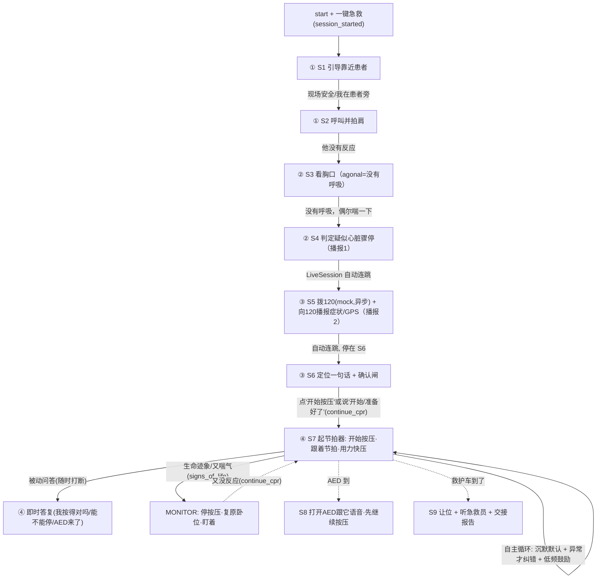

# Live Speech 测试流程（1 期 Demo 主线）

> 本文是 **FirstAid Copilot** 语音（Live / WebSocket）交互的 step-by-step 测试脚本，覆盖一次完整急救主线的四段：
> ① 启动与引导 → ② 状态反馈与判断（agonal 直白化）→ ③ 紧急呼救（自动拨 120 + 向 120 播报症状/GPS，120 为非语音 mock 旁路）→ ④ CPR 指导（**S6 单次"开始按压"确认闸 → 进入 S7 自主循环：沉默默认 + 异常才纠错 + 可随时打断问答**）。
>
> ⚠️ 交互范式已重做：退役"你说我做"逐句口令（`cprCoachEngine.js` 与 `knowledge/cpr_coach_steps.json` 已删除）。阶段 A（判断）是快速漏斗，阶段 B（复苏）由时钟/视觉驱动、单声音、节拍器恒响。本文断言以"新行为 + 新话术"为准。
>
> 每一步给出：**测试者动作**（要说的话 / 要发送的 WS 控制消息）、**期望 stage**、**期望 Agent TTS 关键子串**、**期望 Live 事件序列**、**通过判据**。
> 文末给出**手动跑法**（`npm run voice:serve` 浏览器麦克风逐步核对）与**自动化跑法**（`npm run probe:live` 与 `test/live-speech-flow.test.js`，均已落地）。

---

## 1. 被测链路与前置条件

被测链路：

```text
浏览器/probe ──WS──► /ws/live (wsGateway)
   └─► LiveSession.processTurn
        └─► service.createGuidance → runAgentPipeline(状态机) → liveDriver(被动问答 + S6 就绪快路径) 仲裁
             └─► 流式 TTS ──► thinking / final / guidance / state / audio_begin / (PCM16) / audio_end
```

关键事实（来自源码，便于断言）：

- HTTP `/api/turn` 与 WS `/ws/live` **共享同一个 service 实例与 `sessions` Map**（`src/voice/server.js`）。浏览器“一键急救”走 HTTP 推进到 `S1`，Live 麦克风用**相同 `sessionId`** 续跑同一会话。
- 会话首次创建时会自动注入一个 `session_started` 种子事件（`src/voice/service.js`），因此首条用户发言会带着该种子一起过状态机。
- `scene_safe` 语音意图会把 `scope.scene_safe=true`（`src/engine/sessionReducer.js`），所以纯语音“现场安全了”即可让 `S1→S2`，无需额外 mock。
- GPS 注入：`device_state.location` / `metadata.location` 会写入 `state.location` 并置 `gps_attached=true`（reducer）。因此用 `{type:"context", payload:{deviceState:{location}}}` 即可为后续 `S5` 的“向 120 播报”准备坐标。
- 医疗主线由**状态机**确定性驱动；`S3/S4/S5/S6/S7(起步)` 为 `critical`/带工具动作，guidance 源为 `state_machine_critical`，不会被 Gemma 改写。非关键步（如 `S2`）可能由 `state_machine` 或 `gemma_agent` 给出。
- Live 下混合 NLU 现为**默认开启、异步纠正、不阻塞回合**：`.env` 已置 `INTENT_NLU=on` 且 `GEMMA_NLU_ASYNC=1`，每轮先用正则/关键词即时兜底推进，Gemma 在后台异步推理并写入 NLU 缓存，供**下一轮**命中纠正。因此本回合不会因等待本地 2.4GB CPU 模型而卡顿；偶发模糊语料可能要到下一轮才被 Gemma 纠正。同时修复了 Live 下意图解析 stage 恒被当成 `S1` 的 bug（现跨轮可拿到真实 `current_stage`），按 stage 区分的 NLU 升级在 Live 下才真正生效。
- 真实 `/ws/live` 会话默认开启 `LiveSession` 自主 tick：S2/S3 沉默观察窗约 12 秒后只做保护推进并最终停在 S6；若入口带 `metadata.wake_phrase` / `entry_source:"wake_phrase"`，观察窗压短到约 5 秒，但**不跳过 S3、不预设 normal_breathing**。S7 保持沉默默认；仅在质量良好且距离上次纠错足够久时，才低频播报“你做得很好，跟着节拍继续。”。

前置条件：

1. 已能本地启动语音服务（`npm run voice:serve`），或在 Node 进程内构造 `LiveSession`（probe）。
2. TTS：手动模式建议配好 sherpa-onnx；probe 用 mock 流式 TTS 即可（只断言事件与文本，不依赖真实音频）。
3. STT：本脚本以**文本注入**（`{type:"final", text}`）模拟“说完一句”，规避真实 STT 抖动；真实麦克风识别在手动模式下另行验证。

---

## 2. 四段流程总览



---

## 3. Live 事件与控制消息基线

### 3.1 控制消息速查（测试者 → 服务端，WS 文本帧 JSON）

| 控制消息 | 作用 | 备注 |
| --- | --- | --- |
| `{type:"start", sessionId}` | 建会话/握手 | 服务端回 `state(status:"connected")` |
| `{type:"context", payload:{...}}` | 缓存上下文（GPS、mock 视觉等），合并进后续每一轮 | 不产生事件；注入 `deviceState.location` 即可备好 120 播报坐标 |
| `{type:"inject", payload:{...}}` | 以一条**无用户文本**的感知事件触发一轮（如 `session_started`） | 用于产生独立的 `S1` 引导句 |
| `{type:"final", text:"..."}` | 模拟“一句说完”，驱动一轮指导 | 等价 `commit_text`；本脚本主用 |
| `{type:"commit"}` / `{type:"end"}` | 提交缓冲音频（真实 STT 路径） | 手动麦克风模式由静音断句自动触发 |
| `{type:"barge_in"}` | 打断当前播报 | 服务端回 `audio_cancel`；注：手动模式客户端 VAD 现需能量**持续约 320ms 且高于更高的打断阈值**（`bargeInMinRms≈0.08`）才自动触发，避免回声/偶发噪声误打断 |
| `{type:"reset"}` | 清空上下文并重置会话 | 回 `state(status:"reset")` |

### 3.2 服务端事件与“单轮基线序列”

服务端事件（`src/voice/liveSession.js`）：`thinking` / `partial` / `final` / `guidance` / `state` / `audio_begin` / `audio_end` / `audio_cancel` / `error`，音频本体为 `audio_begin` 与 `audio_end` 之间的若干 **PCM16 二进制帧**。

为表格紧凑，约定**事件简写**：

| 简写 | 事件 | 出现条件 |
| --- | --- | --- |
| 〔T〕 | `thinking` | 每轮开头 |
| 〔F〕 | `final` | 每轮（含 `text`、`intent`） |
| 〔G〕 | `guidance` | 有 guidanceAction 时（含 `action`、`source`、`response_type`） |
| 〔S〕 | `state` | 有最新会话状态时（含 `current_stage`、`state`） |
| 〔A〕 | `audio_begin → PCM16 帧… → audio_end` | TTS 文本非空时 |

**单轮基线序列**：`〔T〕→〔F〕→〔G〕→〔S〕→〔A〕`。
握手时另有 `state(status:"connected")`，以及 STT 模式确定后的 `state(stt_mode:…)`。

### 3.3 自动连跳（S4→S5→S6）的事件形态

`LiveSession`（Part 1C）在一轮落到“过渡态”时会**有界（≤2 段）自动续跳**：一次用户发言判定 `S4` 后，会用合成系统事件继续推进到 `S5`（拨号 + 向 120 播报）、再到 `S6`（**定位一句话 + 确认闸**），最后**停在等待用户确认的 S6**——开始按压是唯一需要多模确认的一步，自动连跳不会替用户越过它进 S7。

因此“没有呼吸…”这一句之后，测试者应观察到**连续多段** `〔G〕〔S〕〔A〕`（每个 stage 一段），形如：

```text
〔T〕〔F〕  ┐ 用户这一轮
〔G〕〔S〕〔A〕   ← S4 播报1：疑似骤停
〔G〕〔S〕〔A〕   ← S5 播报2：拨120 + 向120播报(GPS/症状)
〔G〕〔S〕〔A〕   ← S6 定位一句话 + 确认闸（说“开始”或点“开始按压”才进 S7）
```

> 容差：自动续跳由 `LiveSession` 在服务端完成，合成轮**可能**再次出现 `〔T〕〔F〕`（无用户文本）；断言时以“`S4→S5→S6` 三段 `guidance`/`audio` 依序出现、最终停在 `S6`”为准，不强求合成轮是否带 `thinking/final`。HTTP `/api/turn` 单步语义不受影响（一轮一段）。

### 3.4 自主 tick 的事件形态

真实 `/ws/live` 构造点默认传入 `autonomousTick:true`。它只在服务端静默一段时间后合成 `processTurn` 事件：

- S2/S3：到达观察窗时分别注入 `patient_state_update(responsive:false)` / `breathing_update(normal_breathing:false)`，一次只推进一格；S3 后仍沿既有 S4→S5→S6 自动连跳，**停在 S6**，绝不自动进入 S7。
- 唤醒词入口：`metadata.wake_phrase` 或 `metadata.entry_source` 会写入 `state.scope`；LiveSession 只用它把 S2/S3 窗口从约 12 秒压到约 5 秒，不跳过任何判断步骤。
- S7：默认沉默。若 `tick.encourage` 开启，且超过鼓励节流间隔、近期没有纠错，才注入 `encourage_tick`；规则反馈会在所有真实纠错之后才选择 `encourage_rescuer`。

### 3.5 关键话术来源与容差

- 既有状态机话术（S1–S7 起步、被动问答）以 `src/engine/stateMachine.js`、`src/voice/liveDriver.js` 为准。
- “向 120 播报”脚本由 `generateCallBrief`（`src/report/callBrief.js`）生成，挂在 `guidance.action.call_brief.script`（并写入 `emergency_call.briefing.script`）；S5 朗读句仍以“我将为你拨打 120…”开头，播报词为可见脚本/可选第二段语音。
- S6 确认闸话术、S7 起步/纠错话术、AED 只引导、S9 交接等以 `src/engine/stateMachine.js`、`src/voice/liveDriver.js`、`src/engine/ruleFeedbackEngine.js` 与 `knowledge/safety_phrases.json` 为权威（见附录 A）。"你说我做"逐句口令与 `knowledge/cpr_coach_steps.json` 已退役，**不再有逐句推进**（见附录 B）。
- 断言一律用**关键子串包含**而非整句相等，避免标点/空格（如“拨打 120”含空格）造成脆性。

---

## 4. Step-by-step 测试脚本

> 统一连续编号；`P*` 为准备步骤。话术示例可替换为同义表达，只要命中对应意图触发词（附录 D）。

### 准备步骤

| 步骤 | 测试者动作 | 期望事件 | 通过判据 |
| --- | --- | --- | --- |
| P1 | 连接 `/ws/live` 后发送 `{type:"start", sessionId:"live_test_1"}` | `state(status:"connected")`，随后 `state(stt_mode:…)` | 收到 `connected`，无 `error` |
| P2 | 注入 mock GPS + 回拨号码（在 S4 之前任意时刻）：`{type:"context", payload:{deviceState:{location:{address_line:"示例市示例区示范路 1 号", landmark:"地铁A口", latitude:31.230416, longitude:121.473701, accuracy_m:18}, callback_number:"13800000000"}}}` | 无（上下文缓存） | 不报错；后续 `state.location` 可被 S5 播报使用 |

### 段① 启动与引导

| 步骤 | 测试者动作 | 期望 stage | TTS 关键子串 | 事件序列 | 通过判据 |
| --- | --- | --- | --- | --- | --- |
| 1 | `{type:"inject", payload:{eventType:"session_started", metadata:{adult_likely:true, recording:true}, deviceState:{recording:true, emergency_call_started:false}}}` | `S1_SCENE_SAFE` | `周围安全`、`靠近患者`（整句：开始录制，先确认周围安全；安全后靠近患者。） | 〔T〕〔F〕〔G〕〔S〕〔A〕 | stage=`S1_SCENE_SAFE`；`guidance.source` ∈ {`state_machine`}；TTS 命中子串 |
| 2 | `{type:"final", text:"现场安全了，我在患者旁"}` | `S2_CHECK_RESPONSE` | `轻拍`、`双肩`（请大声叫他，并轻拍双肩。） | 〔T〕〔F〕〔G〕〔S〕〔A〕 | stage=`S2_CHECK_RESPONSE`；`final.intent`=`scene_safe`；`guidance.source` ∈ {`state_machine`,`gemma_agent`} |

### 段② 状态反馈与判断

| 步骤 | 测试者动作 | 期望 stage | TTS 关键子串 | 事件序列 | 通过判据 |
| --- | --- | --- | --- | --- | --- |
| 3 | `{type:"final", text:"他没有反应"}` | `S3_CHECK_BREATHING` | `胸口`、`偶尔大口喘`、`没有呼吸`（看他的胸口。只是偶尔大口喘，或者完全不动，都算没有呼吸。）<br>⚠️ 去"正常起伏"：S3 主动把 agonal/不动直白框定为"没有呼吸"，避免路人误判为"在呼吸" | 〔T〕〔F〕〔G〕〔S〕〔A〕 | stage=`S3_CHECK_BREATHING`；`final.intent`=`patient_unresponsive`；`guidance.source`=`state_machine_critical` |
| 4 | `{type:"final", text:"没有呼吸，偶尔喘一下"}` | `S4_SUSPECTED_ARREST`（随后自动连跳，见段③） | `疑似`、`胸外按压`（请按疑似心脏骤停处理。现在准备胸外按压。） | 〔T〕〔F〕〔G〕〔S〕〔A〕**（S4 段）** + 自动续跳 | stage 先到 `S4_SUSPECTED_ARREST`；`final.intent`=`agonal_breathing`（或 `no_normal_breathing`）；`guidance.source`=`state_machine_critical`；本轮随后自动出现 S5、S6 段（见段③） |

> 说明：第 4 步一句话同时触发“判定骤停 + 自动拨号 + 进 CPR 准备”。段③的两段为**同一轮**的自动续跳，非新的用户动作。

### 段③ 紧急呼救（自动拨号 + 向 120 播报）

| 步骤 | 触发 | 期望 stage | TTS / 播报关键子串 | 事件序列 | 通过判据 |
| --- | --- | --- | --- | --- | --- |
| 5 | （自动，承接第 4 步） | `S5_CALL_EMERGENCY` | 朗读句：`我将为你拨打`、`免提`、`胸外按压`；**向 120 播报词**（`call_brief.script`）：`这里是`、`坐标`、`定位精度约`、`无反应`、`无正常呼吸`、`按疑似心脏骤停处理`、`回拨号码`、`请派救护车` | 〔G〕〔S〕〔A〕（承接同一轮） | stage=`S5_CALL_EMERGENCY`；`guidance.action.intent`=`start_emergency_call_and_cpr`；`guidance.source`=`state_machine_critical`；`guidance.action.call_brief.script`（或 `tool_actions[].briefing.script`）命中全部播报子串 |
| 6 | （自动连跳） | `S6_CPR_READY` | 定位一句话 + 确认闸，命中：`胸口中央`、`胳膊伸直`、`开始按压`（双手叠在他胸口中央，胳膊伸直。准备好就说“开始”，或点开始按压。） | 〔G〕〔S〕〔A〕（承接同一轮），随后**停在 S6 等待用户确认** | stage=`S6_CPR_READY`；本轮在此停止自动连跳；TTS 命中“胸口中央/胳膊伸直/开始按压”；S6 主按钮标签为“开始按压”（`action: mark_cpr_ready`） |

**向 120 播报词示例**（基于 P2 注入的 mock GPS，由 `generateCallBrief` 生成）：

```text
这里是示例市示例区示范路 1 号，地标地铁A口，坐标31.230416,121.473701，定位精度约18米。现场成人无反应、无正常呼吸，可能喘息样呼吸，按疑似心脏骤停处理，准备胸外按压。回拨号码13800000000。请派救护车。
```

> 容差：S6 现为唯一的多模确认闸（`src/engine/stateMachine.js` 的 `S6_CPR_READY`），话术 = 一句定位 + “说开始 / 点开始按压”，措辞保持果断指令（不触发禁语“让用户自决”）。判据以命中“胸口中央 / 胳膊伸直 / 开始按压”为准；能否在 S6 **一步确认**翻进 S7 才是段④的重点。若未注入 GPS（如手动模式），播报词会出现“位置未获取/未获取”，属预期降级。

### 段④ CPR 指导（S6 单次确认闸 → S7 自主循环 + 可打断问答）

#### 4.1 S6 单次“开始按压”确认闸 → 进入 S7 自主循环

开始按压是唯一需要**多模确认**的一步：在 `S6_CPR_READY`，用户**点“开始按压”大按钮**或**说出就绪/开始类口语**任一即可。就绪快路径（`src/voice/service.js`）接受「开始 / 现在开始 / 这就开始 / 可以了 / 准备好了 / 我准备好了 / 没有呼吸」等，解析为 `continue_cpr`（`guidance.source=rule_flow_fast_path`，`fastPath=s6_readiness_continue_cpr`），置 `cpr_state.started=true`，**一步翻转 `S6→S7_CPR_LOOP` 并起播节拍器**。

> 已退役：不再有“你说我做”逐句口令（无 `lay_flat/hand_center/arms_straight/press_30/keep_going`，无 `cpr_state.coach_step`）。`step_done`/`compressions_reported` 意图仍保留但**不再驱动逐句口令**（`compressions_reported` 仍维持 `cpr_state.started` 链路）。进入 S7 后是**时钟/视觉驱动的自主循环**：节拍器恒响、沉默默认（management by exception）、只有异常（视觉 `cpr_quality` 越界）才出声纠错、低频鼓励；用户可随时插话打断（见 4.2）。“急救员到了 / 他动了”等分流/再入意图不被确认闸折叠。

| 步骤 | 测试者动作（话术 / 控制消息） | 期望 stage | TTS 关键子串 | 事件序列 | 通过判据 |
| --- | --- | --- | --- | --- | --- |
| 7 | `{type:"final", text:"我准备好了"}`（S6 就绪快路径 → `continue_cpr`） | `S7_CPR_LOOP` | 起步句：`开始按压`、`跟着节拍`、`用力快压`（现在开始按压，跟着节拍，用力快压。） | 〔T〕〔F〕〔G〕〔S〕〔A〕 | **stage 翻转到 `S7_CPR_LOOP`**；`final.intent`=`continue_cpr`；`guidance.source`=`rule_flow_fast_path`；`state.cpr_state.started=true`；命中子串 |
| 7' | 等价确认：点 S6 主按钮「开始按压」（`mark_cpr_ready`），或说「开始 / 可以了 / 这就开始 / 没有呼吸」 | `S7_CPR_LOOP` | 同上（起步句一致） | 〔T〕〔F〕〔G〕〔S〕〔A〕 | 同上：任一确认通道都**一步**进 S7、起播节拍器 |
| 8 | （进入 S7 后保持沉默观察）视觉 `cpr_quality` 正常 → 不打断 | `S7_CPR_LOOP` | 无异常时可不出声；偶发低频鼓励 `你做得很好，跟着节拍继续。` | 〔T〕〔F〕〔S〕（可无〔A〕） | 沉默默认成立；stage 不变；**无**逐句口令推进；若刚发生纠错则不鼓励 |

> 容差：S6 就绪话术变体均应**一步**翻进 `S7_CPR_LOOP`（核心判据：`finalStage=S7_CPR_LOOP` / `source=rule_flow_fast_path` / `intent=continue_cpr` / `cpr_state.started=true`）。S7 起步句命中“开始按压 / 跟着节拍 / 用力快压”（**不再含“震动”**）。S7 内的质量纠错由视觉 `cpr_quality` 驱动（见 4.2 / 附录 A），不依赖口头汇报。话术权威见附录 A。

#### 4.2 被动问答（S7 随时插话，应即时命中 `rule_fast_path`）

| 步骤 | 测试者动作 | 期望 stage | TTS 关键子串 | 事件序列 | 通过判据 |
| --- | --- | --- | --- | --- | --- |
| 12 | `{type:"final", text:"我按得对吗"}`（`ask_cpr_quality`） | `S7_CPR_LOOP` | `按压可以`、`100 到 120` | 〔T〕〔F〕〔G〕〔S〕〔A〕 | `guidance.source`=`rule_fast_path`；`response_type`=`question_answer`；`action.intent`=`answer_current_cpr_question`；命中子串 |
| 13 | `{type:"final", text:"我能不能停"}`（`ask_can_stop`） | `S7_CPR_LOOP` | `不要停`、`继续按压`、`急救人员接手`、`恢复正常呼吸`（不要停，继续按压；等 AED 或急救人员接手、或他恢复正常呼吸再停。）<br>⚠️ 去"AED 提示分析"类设备操作话术 | 〔T〕〔F〕〔G〕〔S〕〔A〕 | 同上（`rule_fast_path` / `question_answer`）；命中子串 |
| 14 | `{type:"final", text:"AED 来了怎么办"}`（`ask_aed_help`） | `S7_CPR_LOOP` | `打开 AED`、`跟着它的语音`、`先继续按压`（打开 AED，跟着它的语音做；先继续按压。）<br>⚠️ AED **只引导**：不再口述"贴电极/设备提示分析时暂停" | 〔T〕〔F〕〔G〕〔S〕〔A〕 | 同上（`rule_fast_path` / `question_answer`）；命中子串 |

> 说明：被动问答**不改变 stage**、**不打断主流程的连续性**，但应低延迟即时作答（`liveProposal` 经 `validateAction` 后优先于状态机普通动作）。S8(AED 到达事件流) 的状态机话术为"AED 到了，打开它，跟着它的语音做；先继续按压。"，与被动问答口径一致。

#### 4.3 生命迹象再入（ROSC）与交接

| 步骤 | 测试者动作 | 期望 stage | TTS 关键子串 | 通过判据 |
| --- | --- | --- | --- | --- |
| R1（可选） | 在 S7 说 `{type:"final", text:"他又喘气了"}`（`signs_of_life`，触发词：他动了/他醒了/他在喘气了/又有呼吸了/恢复了） | `MONITOR_BREATHING` | `停止按压`、`复原姿势`、`再没反应就立刻重新开始按压` | stage 由 `S7_CPR_LOOP→MONITOR_BREATHING`；停按压、复原卧位、随时可重启 |
| R2（可选） | 在 `MONITOR_*` 说 `{type:"final", text:"他又没反应了"}`（`continue_cpr`/`no_normal_breathing`/`unresponsive`） | `S7_CPR_LOOP` | 起步句：`开始按压`、`跟着节拍`、`用力快压` | stage 重启回 `S7_CPR_LOOP`；`MONITOR_*` 非 terminal（`stages.js` 已加双向转移） |

> 说明：ROSC 再入用例验证"易开难停"——生命迹象（高置信）才停按压、转监护；监护中一旦再恶化（低门槛）立刻重启 CPR。`stages.js` 的 `S7_CPR_LOOP→MONITOR_BREATHING` 与 `MONITOR_*→S7_CPR_LOOP` 转移、以及 `MONITOR_*` 改为非 terminal，是这条链路的状态机基础。

### 可选收尾（超出四段主线，便于端到端贯通）

| 步骤 | 测试者动作 | 期望 stage | TTS 关键子串 | 通过判据 |
| --- | --- | --- | --- | --- |
| 15（可选） | `{type:"final", text:"救护车到了"}`（`paramedics_arrived`） | `S9_HANDOVER` | `让给他们`、`后面听他们的`、`交接报告`（急救员到达，把位置让给他们，后面听他们的。我在生成交接报告。） | stage=`S9_HANDOVER`；`action.intent`=`generate_handover_report`；`guidance.source`=`state_machine_critical` |

---

## 5. 两种跑法

### 5.1 手动跑法（`npm run voice:serve` + 浏览器 Live 麦克风）

先启动服务：

```bash
npm run voice:serve
```

再按下列步骤逐段核对：

1. 打开 `http://127.0.0.1:8787`。
2. 点击 **「一键急救」**：页面 `Stage` 显示 `S1_SCENE_SAFE`（HTTP `session_started`）。此操作会重置会话并以当前 `sessionId` 开始。
3. 勾选 **「Live 开」**，授权麦克风；状态条进入 `Listening`。Live 与“一键急救”共享同一 `sessionId`，因此从 `S1` 续跑。
4. 按四段脚本**逐句对麦克风说**。注意**断句由两条路径之一决定**（取决于流式 STT 是否就绪）：
   - **流式 STT（默认、常见）**：断句由服务端流式识别的**端点检测**决定——识别出文字后**尾随静音约 0.8 秒**即判定一句结束（`scripts/speech/sherpa_stt_stream.py` 的 `rule2`，可经 `SPEECH_STT_STREAM_RULE2_MIN_TRAILING_SILENCE` 调整）。⚠️ 此值此前误设为 **0.35s**，远低于 sherpa 官方 1.2s，会把句间换气/停顿当成说完、**半句就提前切断转录**；现已上调到 0.8s（仍偏紧可加到 1.0–1.2）。客户端那个 1200ms 静音窗在流式就绪时**不会生效**。
   - **缓冲兜底（流式不可用时才走）**：由浏览器客户端静音窗触发 `commit`，静音窗 **1200ms**，且整段需累计 **≥250ms 真实语音**才提交，纯噪声 blip 会被静默丢弃不触发杂散回合。
   - ①「现场安全了，我在患者旁」→ 观察 `Stage=S2`、播报“呼叫并拍肩”。
   - ②「他没有反应」→ `S3`（播报“看胸口…偶尔大口喘或不动都算没有呼吸”）；「没有呼吸，偶尔喘一下」→ **连续听到 3 段播报**（S4 疑似骤停 → S5 拨 120/向 120 播报 → S6 定位一句话 + 确认闸），最终停在 `S6`。
   - ④ 在 `S6` **点「开始按压」或说「开始 / 准备好了 / 可以了」** → 一步进入 `S7`，起播节拍器并听到“开始按压，跟着节拍，用力快压”；之后**无需逐句汇报**（沉默默认）。其间随时插话「我按得对吗 / 我能不能停 / AED 来了怎么办」，应被**即时**回答（`Response Type=question_answer`、`Live Driver=rule_fast_path`，AED 只引导“跟着它的语音做，先继续按压”）。若说「他又喘气了 / 他动了」→ 进 `MONITOR`（停按压、复原卧位）；再说「他又没反应了」→ 重启回 `S7`。
5. 逐步核对页面指标：`Stage`、`Guidance Source`、`Response Type`、`Live Driver`、`TTS` 文本框与实际播报语音；播报中若要打断（barge-in），需**持续出声约 320ms 且音量高于更高的打断阈值**（`bargeInMinRms≈0.08`）才会触发、状态条切到 `Capturing`，因此播报不会再被自己的回声/偶发噪声切断、状态也不会动不动跳回 `Listening`。

手动模式注意事项：

- 页面**没有 GPS 注入入口**，因此手动模式主要验证**话术与流程**；S5“向 120 播报”会因缺少坐标显示“位置未获取/未获取”。要核对**带 GPS 的完整播报词**，请用 5.2 的自动化 probe 注入 mock GPS。
- 若浏览器/麦克风受限，可用页面的「录音」「选择音频」按钮回退；真实 STT 抖动属正常，话术核对以语义为准。

### 5.2 自动化跑法（已实现）

- 一键探针（`scripts/liveSpeechScenarioProbe.mjs`，`package.json` 脚本 `probe:live`）：

```bash
npm run probe:live
```

  行为：进程内构造 `LiveSession`（注入 mock 流式 TTS + stub Gemma runtime），用本文件的控制消息逐步驱动（`{type:"final", text}` 模拟说完一句，`{type:"context", payload:{deviceState:{location}}}` 注入 mock GPS），收集每轮 `json` + `audio` 事件，断言 **stage / intent / guidance source / TTS 子串 / 事件顺序（含自动连跳的多段 guidance/audio）**，输出 `artifacts/live-speech-flow-*.json` 并打印 `PASS/FAIL`。当前覆盖：S1→S2→S3（agonal 直白）→ 自动连跳 S4/S5/S6 停在确认闸 → **CORE：S6 就绪快路径一步进 S7（`rule_flow_fast_path`/`continue_cpr`/`started=true`，起步句"开始按压/跟着节拍/用力快压"）** → S7 被动问答（质量/能不能停/AED 只引导）。自主 tick 的短窗/鼓励细节由 `test/autonomous-loop.test.js` 覆盖。

- 单元/集成用例（`test/live-speech-flow.test.js`）：

```bash
node --test test/live-speech-flow.test.js
# 或运行全部测试
npm test
```

  行为：用 `node:test` 跑同一主线，断言完整事件序列与新口径话术（自动拨号播报、S6 单次确认闸一步进 S7、就绪话术变体、被动问答即时命中 `rule_fast_path`）。

- 自主循环细节（`test/autonomous-loop.test.js`）：

```bash
node --test test/autonomous-loop.test.js
```

  行为：断言 S2/S3 沉默保护推进并停在 S6、唤醒词先验压短观察窗但不跳过 S3、S7 `encourage_tick` 的节流/近期纠错抑制，以及规则反馈中真实纠错优先于鼓励。

---

## 附录

### A. 关键 TTS 话术对照（状态机 / 被动问答）

> 单声音口径：节拍器是**声音**（不再震动），话术统一为"跟着节拍"，**全表无"震动"**；AED **只引导**（跟着它的语音做、先继续按压），不口述"贴电极/设备提示分析时暂停"；S3 把 agonal/不动直白框定为"没有呼吸"；S9 补"后面听他们的"。来源：`stateMachine.js` / `liveDriver.js` / `ruleFeedbackEngine.js` / `knowledge/safety_phrases.json`。

| stage / 场景 | 话术（整句） | 断言子串 |
| --- | --- | --- |
| S1（session_started） | 开始录制，先确认周围安全；安全后靠近患者。 | 周围安全 / 靠近患者 |
| S2 | 请大声叫他，并轻拍双肩。 | 轻拍 / 双肩 |
| S3（agonal 直白） | 看他的胸口。只是偶尔大口喘，或者完全不动，都算没有呼吸。 | 胸口 / 偶尔大口喘 / 没有呼吸 |
| S4 | 请按疑似心脏骤停处理。现在准备胸外按压。 | 疑似 / 胸外按压 |
| S5（朗读句） | 我将为你拨打 120，请保持手机免提。现在准备胸外按压。 | 我将为你拨打 / 免提 / 胸外按压 |
| S6（确认闸） | 双手叠在他胸口中央，胳膊伸直。准备好就说“开始”，或点开始按压。 | 胸口中央 / 胳膊伸直 / 开始按压 |
| S7（起步） | 现在开始按压，跟着节拍，用力快压。 | 开始按压 / 跟着节拍 / 用力快压 |
| S7 纠错·频率偏慢（rate_low） | 再快一点，跟着节拍按。 | 再快一点 / 跟着节拍 |
| S7 纠错·频率偏快（rate_high） | 稍微慢一点，跟着节拍按。 | 稍微慢一点 / 跟着节拍 |
| S7 纠错·中断（interruption） | 不要停，继续按压。 | 不要停 / 继续按压 |
| S7 低频鼓励（encourage_tick） | 你做得很好，跟着节拍继续。 | 你做得很好 / 跟着节拍 |
| safety·节奏（metronome） | 跟着节拍按，快速有力。 | 跟着节拍 / 快速有力 |
| 被动·我按得对吗 | 按压可以，继续保持 100 到 120 次每分钟。 | 按压可以 / 100 到 120 |
| 被动·能不能停 | 不要停，继续按压；等 AED 或急救人员接手、或他恢复正常呼吸再停。 | 不要停 / 继续按压 / 急救人员接手 |
| 被动·AED 来了（liveDriver） | 打开 AED，跟着它的语音做；先继续按压。 | 打开 AED / 跟着它的语音 / 先继续按压 |
| S8·AED 到达（状态机事件流） | AED 到了，打开它，跟着它的语音做；先继续按压。 | AED 到了 / 跟着它的语音 / 先继续按压 |
| MONITOR·生命迹象再入（ROSC） | 他有动静了，停止按压。把他翻成侧躺的复原姿势，盯着他的呼吸。他再没反应就立刻重新开始按压。 | 停止按压 / 复原姿势 / 重新开始按压 |
| S9·交接 | 急救员到达，把位置让给他们，后面听他们的。我在生成交接报告。 | 让给他们 / 后面听他们的 / 交接报告 |

### B. “你说我做”逐句口令已退役（确认闸 + 自主循环取代）

交互范式重做后，**逐句"你说我做"口令已整体退役**：`src/engine/cprCoachEngine.js` 与 `knowledge/cpr_coach_steps.json` 已删除，`service.js` 去掉 coach 仲裁分支，`sessionReducer.js` 去掉 `reduceCprCoachStep` 与 `cpr_state.coach_step`。原 `lay_flat / hand_center / arms_straight / press_30 / keep_going` 五句口令**不再存在**，对应断言一律删除或改写为下表的新主线。

| 旧（已退役） | 新（取代它的行为） |
| --- | --- |
| S6 逐句口令 `lay_flat`/`hand_center`/`arms_straight`（按 `step_done` 推进） | S6 **单次确认闸**：一句定位（双手叠在胸口中央，胳膊伸直）+ "说开始/点开始按压"；不逐句推进 |
| S7 口令 `press_30`/`keep_going`（按 `compressions_reported` 推进） | S7 **自主循环**：节拍器恒响 + 沉默默认 + 视觉 `cpr_quality` 越界才纠错 + 低频鼓励；可随时打断问答 |
| `step_done` 驱动 coach 下一句 | `step_done` 意图**保留但不再驱动任何口令** |
| `compressions_reported` 驱动 coach 下一句 | `compressions_reported` 意图保留，仅维持 `cpr_state.started` 链路，不推进口令 |

### C. 向 120 播报字段（`generateCallBrief` → `call_brief.script`）

播报词由四段拼成：**位置句**（这里是… + 坐标… + 定位精度约…米）→ **评估句**（现场成人 + 无反应、无正常呼吸[/可能喘息样呼吸] + 按疑似心脏骤停处理 + 准备胸外按压）→ **回拨句**（回拨号码…）→ **派车句**（请派救护车）。

- 注入位置（任选其一，二者都会写入 `state.location`）：`context.payload.deviceState.location` 或 `context.payload.metadata.location`。
- 字段：`address_line` / `landmark` / `floor` / `latitude` / `longitude` / `accuracy_m`（坐标保留 6 位小数；`accuracy_m > 100` 会追加“定位可能不精确”）。
- 回拨号码：可经 `deviceState.callback_number` 注入；缺失时播报“回拨号码未提供”。
- 缺坐标/地址时位置句降级为“位置未获取、未获取”。

### D. 相关 / 新增意图触发词（命中即驱动对应步骤）

| 意图 | 触发词示例（节选） | 来源 |
| --- | --- | --- |
| scene_safe | 现场安全、安全了、可以靠近、在患者身边 | `src/voice/stt.js` |
| patient_unresponsive | 他没有反应、没反应、叫不醒、无反应 | `src/voice/stt.js` |
| agonal_breathing | 偶尔喘、喘一下、濒死呼吸、只是喘 | `src/voice/stt.js` |
| no_normal_breathing | 没有正常呼吸、没有呼吸、呼吸不正常 | `src/voice/stt.js` |
| continue_cpr | 开始按、开始 CPR、继续按、继续心肺复苏；**（S6 确认闸快路径增补）** 开始、现在开始、这就开始、可以了、没有呼吸、准备好了、我准备好了、开始吧、可以开始 | `src/voice/stt.js`；就绪/开始类映射在 `S6_CPR_READY` 由确认闸快路径生效（`rule_flow_fast_path` / `fastPath=s6_readiness_continue_cpr`，见 §4.1） |
| ask_cpr_quality | 我按得对吗、位置对吗、节奏对吗、质量怎么样 | `src/voice/stt.js` |
| ask_can_stop | 能不能停、可以停、还要按多久、按到什么时候 | `src/voice/stt.js` |
| ask_aed_help | AED 来了、除颤仪到了、电击怎么用 | `src/voice/stt.js` |
| **signs_of_life**（ROSC 再入） | 他动了、他在喘气了、又有呼吸了、睁眼了、有脉搏 | `src/voice/stt.js`；S7 收到 → `MONITOR_BREATHING`（停按压、复原卧位） |
| **patient_recovered**（ROSC 再入） | 他醒了、苏醒了、清醒了、缓过来了、恢复意识 | `src/voice/stt.js`；同上，触发 ROSC 再入 |
| paramedics_arrived | 救护车到了、急救员到了、医护赶到 | `src/voice/stt.js` |
| step_done（保留，不再推进口令） | 好了、放好了、做好了、明白、可以了 | `src/voice/stt.js`；意图仍解析，但**不再驱动逐句 coach**（coach 已退役） |
| compressions_reported（保留，仅维持 started） | 按了、按了30次、在按了 | `src/voice/stt.js`；维持 `cpr_state.started` 链路，不推进口令 |

> `step_done` / `compressions_reported` 在新范式下**不再驱动任何逐句口令**（`cprCoachEngine` / `cpr_coach_steps.json` 已删除）；保留意图仅为兼容历史语料。`signs_of_life` / `patient_recovered` 是 ROSC 再入的新触发意图，S7 命中后由状态机转入 `MONITOR_BREATHING`（见 §4.3）。
